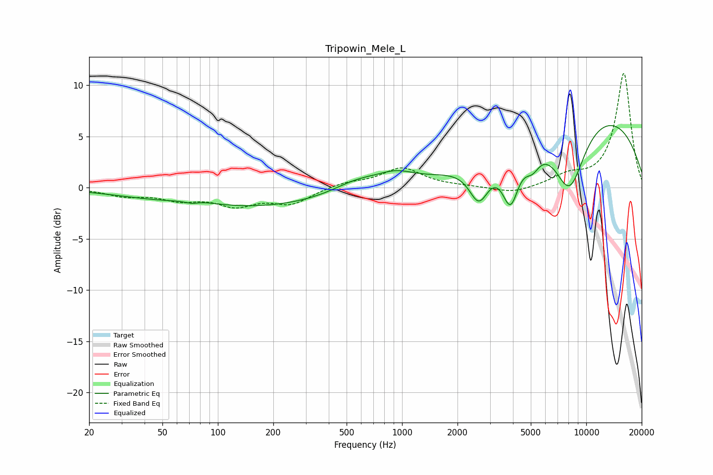

# Tripowin_Mele_L
See [usage instructions](https://github.com/jaakkopasanen/AutoEq#usage) for more options and info.

### Parametric EQs
Apply preamp of -6.2 dB when using parametric equalizer.

|   # | Type    |   Fc (Hz) |    Q |   Gain (dB) |
|-----|---------|-----------|------|-------------|
|   1 | Peaking |        72 | 3.64 |        -0.3 |
|   2 | Peaking |        75 | 1.22 |         0.5 |
|   3 | Peaking |       134 | 0.26 |        -2   |
|   4 | Peaking |       568 | 1.03 |         1.2 |
|   5 | Peaking |       926 | 1.39 |         1.1 |
|   6 | Peaking |      2614 | 2.64 |        -3.6 |
|   7 | Peaking |      3878 | 3.13 |        -4.8 |
|   8 | Peaking |      5093 | 3.43 |        -1.6 |
|   9 | Peaking |      8106 | 1.49 |        -7   |
|  10 | Peaking |     10000 | 0.27 |         7.7 |

### Fixed Band EQs
When using fixed band (also called graphic) equalizer, apply preamp of **-11.2 dB** (if available) and set gains manually with these parameters.

|   # | Type    |   Fc (Hz) |    Q |   Gain (dB) |
|-----|---------|-----------|------|-------------|
|   1 | Peaking |        31 | 1.41 |        -0.7 |
|   2 | Peaking |        62 | 1.41 |        -1   |
|   3 | Peaking |       125 | 1.41 |        -1.6 |
|   4 | Peaking |       250 | 1.41 |        -1.5 |
|   5 | Peaking |       500 | 1.41 |         0.5 |
|   6 | Peaking |      1000 | 1.41 |         1.9 |
|   7 | Peaking |      2000 | 1.41 |         0.1 |
|   8 | Peaking |      4000 | 1.41 |        -0.6 |
|   9 | Peaking |      8000 | 1.41 |         1   |
|  10 | Peaking |     16000 | 1.41 |        11.2 |

### Graphs

