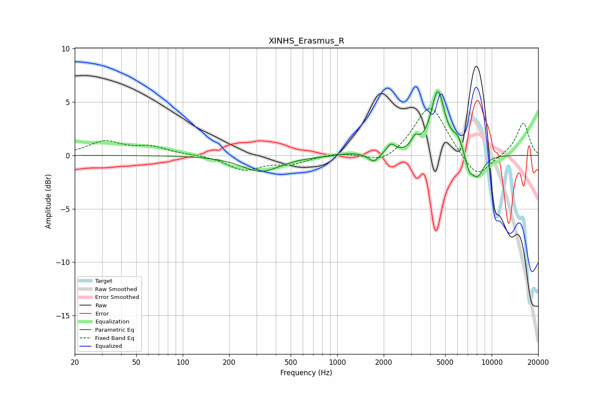

# XINHS_Erasmus_R
See [usage instructions](https://github.com/jaakkopasanen/AutoEq#usage) for more options and info.

### Parametric EQs
Apply preamp of -6.0 dB when using parametric equalizer.

|   # | Type    |   Fc (Hz) |    Q |   Gain (dB) |
|-----|---------|-----------|------|-------------|
|   1 | Peaking |       320 | 1.15 |        -1.5 |
|   2 | Peaking |      1218 | 1.94 |         0.2 |
|   3 | Peaking |      1725 | 4.59 |        -0.8 |
|   4 | Peaking |      2226 | 5.13 |         0.9 |
|   5 | Peaking |      3185 | 6    |         1   |
|   6 | Peaking |      4484 | 3.14 |         5.9 |
|   7 | Peaking |      6013 | 4.15 |         1.2 |
|   8 | Peaking |      7128 | 6    |        -1   |
|   9 | Peaking |      7638 | 3.38 |        -0.2 |
|  10 | Peaking |      8054 | 3.03 |        -2   |

### Fixed Band EQs
When using fixed band (also called graphic) equalizer, apply preamp of **-4.5 dB** (if available) and set gains manually with these parameters.

|   # | Type    |   Fc (Hz) |    Q |   Gain (dB) |
|-----|---------|-----------|------|-------------|
|   1 | Peaking |        31 | 1.41 |         1.3 |
|   2 | Peaking |        62 | 1.41 |         0.7 |
|   3 | Peaking |       125 | 1.41 |         0   |
|   4 | Peaking |       250 | 1.41 |        -1.3 |
|   5 | Peaking |       500 | 1.41 |        -0.7 |
|   6 | Peaking |      1000 | 1.41 |         0.2 |
|   7 | Peaking |      2000 | 1.41 |        -0.9 |
|   8 | Peaking |      4000 | 1.41 |         4.8 |
|   9 | Peaking |      8000 | 1.41 |        -2.3 |
|  10 | Peaking |     16000 | 1.41 |         3.1 |

### Graphs

