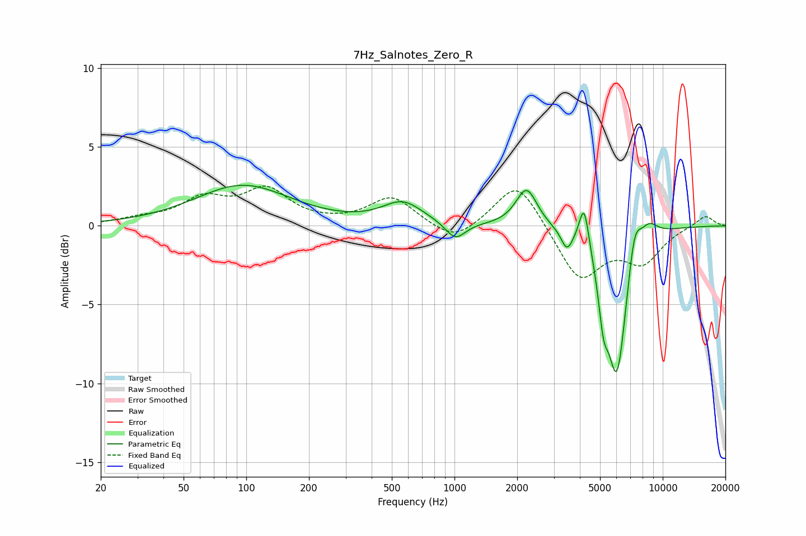

# 7Hz_Salnotes_Zero_R
See [usage instructions](https://github.com/jaakkopasanen/AutoEq#usage) for more options and info.

### Parametric EQs
Apply preamp of -2.7 dB when using parametric equalizer.

|   # | Type    |   Fc (Hz) |    Q |   Gain (dB) |
|-----|---------|-----------|------|-------------|
|   1 | Peaking |        96 | 0.62 |         2.5 |
|   2 | Peaking |       563 | 1.47 |         1.4 |
|   3 | Peaking |      1010 | 2.97 |        -1.1 |
|   4 | Peaking |      2218 | 2.79 |         2.5 |
|   5 | Peaking |      3467 | 5.22 |        -1.2 |
|   6 | Peaking |      4191 | 5.98 |         2.8 |
|   7 | Peaking |      5187 | 5.94 |        -2.8 |
|   8 | Peaking |      6023 | 2.79 |        -9.4 |
|   9 | Peaking |      7313 | 4.29 |         2.4 |
|  10 | Peaking |      8568 | 2.98 |         1   |

### Fixed Band EQs
When using fixed band (also called graphic) equalizer, apply preamp of **-2.6 dB** (if available) and set gains manually with these parameters.

|   # | Type    |   Fc (Hz) |    Q |   Gain (dB) |
|-----|---------|-----------|------|-------------|
|   1 | Peaking |        31 | 1.41 |         0.4 |
|   2 | Peaking |        62 | 1.41 |         1.6 |
|   3 | Peaking |       125 | 1.41 |         2.1 |
|   4 | Peaking |       250 | 1.41 |         0   |
|   5 | Peaking |       500 | 1.41 |         1.8 |
|   6 | Peaking |      1000 | 1.41 |        -1.2 |
|   7 | Peaking |      2000 | 1.41 |         3   |
|   8 | Peaking |      4000 | 1.41 |        -3.4 |
|   9 | Peaking |      8000 | 1.41 |        -2.1 |
|  10 | Peaking |     16000 | 1.41 |         0.7 |

### Graphs

