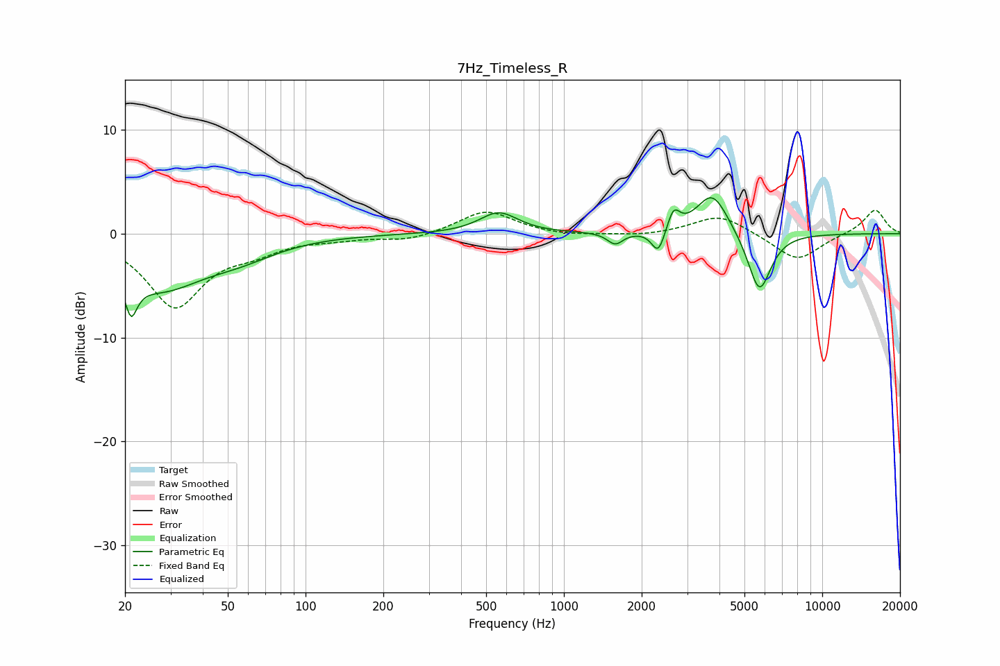

# 7Hz_Timeless_R
See [usage instructions](https://github.com/jaakkopasanen/AutoEq#usage) for more options and info.

### Parametric EQs
Apply preamp of -3.5 dB when using parametric equalizer.

|   # | Type    |   Fc (Hz) |    Q |   Gain (dB) |
|-----|---------|-----------|------|-------------|
|   1 | Peaking |        21 | 5.81 |        -7   |
|   2 | Peaking |        21 | 5.95 |         3.3 |
|   3 | Peaking |        27 | 0.85 |        -4.8 |
|   4 | Peaking |        56 | 0.97 |        -1.5 |
|   5 | Peaking |       559 | 1.91 |         2   |
|   6 | Peaking |      1580 | 4.72 |        -1.1 |
|   7 | Peaking |      2320 | 5.59 |        -2.4 |
|   8 | Peaking |      2656 | 6    |         2   |
|   9 | Peaking |      3757 | 2.26 |         4.1 |
|  10 | Peaking |      5710 | 3.07 |        -5.9 |

### Fixed Band EQs
When using fixed band (also called graphic) equalizer, apply preamp of **-2.3 dB** (if available) and set gains manually with these parameters.

|   # | Type    |   Fc (Hz) |    Q |   Gain (dB) |
|-----|---------|-----------|------|-------------|
|   1 | Peaking |        31 | 1.41 |        -6.9 |
|   2 | Peaking |        62 | 1.41 |        -1.3 |
|   3 | Peaking |       125 | 1.41 |        -0.4 |
|   4 | Peaking |       250 | 1.41 |        -0.7 |
|   5 | Peaking |       500 | 1.41 |         2.3 |
|   6 | Peaking |      1000 | 1.41 |        -0.3 |
|   7 | Peaking |      2000 | 1.41 |        -0.3 |
|   8 | Peaking |      4000 | 1.41 |         1.9 |
|   9 | Peaking |      8000 | 1.41 |        -2.7 |
|  10 | Peaking |     16000 | 1.41 |         2.4 |

### Graphs

