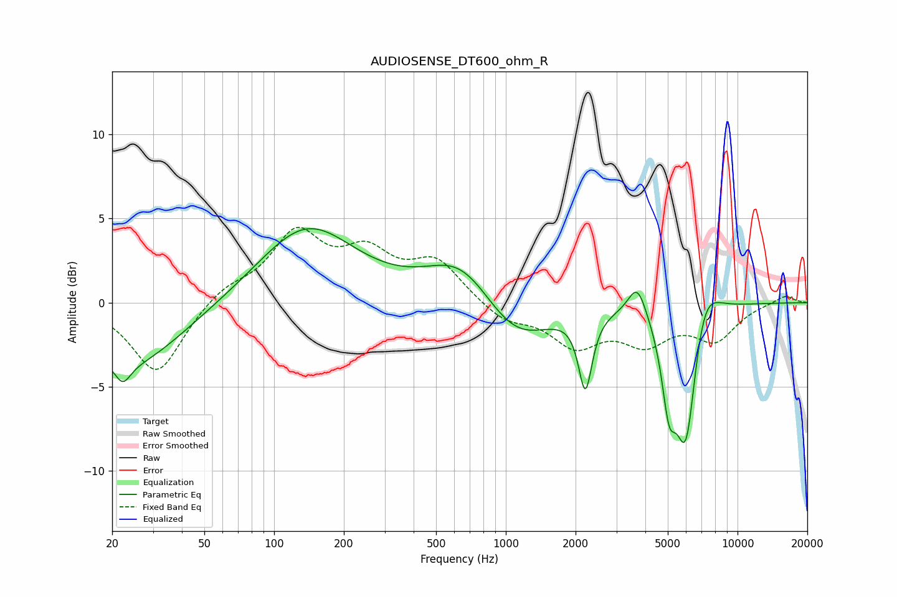

# AUDIOSENSE_DT600_ohm_R
See [usage instructions](https://github.com/jaakkopasanen/AutoEq#usage) for more options and info.

### Parametric EQs
Apply preamp of -4.5 dB when using parametric equalizer.

|   # | Type    |   Fc (Hz) |    Q |   Gain (dB) |
|-----|---------|-----------|------|-------------|
|   1 | Peaking |        22 | 4.22 |        -1.2 |
|   2 | Peaking |        24 | 0.62 |        -3.8 |
|   3 | Peaking |       138 | 0.68 |         4.6 |
|   4 | Peaking |       646 | 0.94 |         2.8 |
|   5 | Peaking |      1093 | 0.93 |        -2.8 |
|   6 | Peaking |      2204 | 4.9  |        -4.5 |
|   7 | Peaking |      3694 | 3.51 |         2   |
|   8 | Peaking |      5056 | 4.61 |        -4.1 |
|   9 | Peaking |      5990 | 2.81 |        -9   |
|  10 | Peaking |      7057 | 2.12 |         3   |

### Fixed Band EQs
When using fixed band (also called graphic) equalizer, apply preamp of **-4.6 dB** (if available) and set gains manually with these parameters.

|   # | Type    |   Fc (Hz) |    Q |   Gain (dB) |
|-----|---------|-----------|------|-------------|
|   1 | Peaking |        31 | 1.41 |        -4.3 |
|   2 | Peaking |        62 | 1.41 |         0.9 |
|   3 | Peaking |       125 | 1.41 |         3.9 |
|   4 | Peaking |       250 | 1.41 |         2.6 |
|   5 | Peaking |       500 | 1.41 |         2.3 |
|   6 | Peaking |      1000 | 1.41 |        -1.1 |
|   7 | Peaking |      2000 | 1.41 |        -2.3 |
|   8 | Peaking |      4000 | 1.41 |        -2.1 |
|   9 | Peaking |      8000 | 1.41 |        -2   |
|  10 | Peaking |     16000 | 1.41 |         0.5 |

### Graphs

