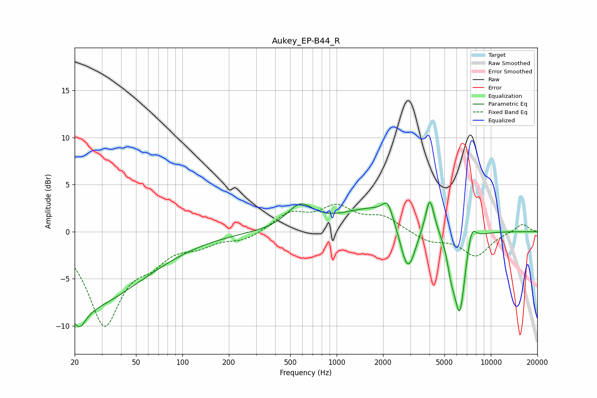

# Aukey_EP-B44_R
See [usage instructions](https://github.com/jaakkopasanen/AutoEq#usage) for more options and info.

### Parametric EQs
Apply preamp of -3.2 dB when using parametric equalizer.

|   # | Type    |   Fc (Hz) |    Q |   Gain (dB) |
|-----|---------|-----------|------|-------------|
|   1 | Peaking |        20 | 0.32 |        -8.2 |
|   2 | Peaking |        21 | 3.61 |        -1.9 |
|   3 | Peaking |       580 | 1.67 |         2.4 |
|   4 | Peaking |      1977 | 0.6  |         2.9 |
|   5 | Peaking |      2141 | 4.6  |         1.7 |
|   6 | Peaking |      2896 | 2.68 |        -6   |
|   7 | Peaking |      4019 | 5.15 |         3.7 |
|   8 | Peaking |      5535 | 5.16 |        -2.4 |
|   9 | Peaking |      6282 | 3.74 |        -8.6 |
|  10 | Peaking |      7499 | 4.62 |         2.1 |

### Fixed Band EQs
When using fixed band (also called graphic) equalizer, apply preamp of **-3.0 dB** (if available) and set gains manually with these parameters.

|   # | Type    |   Fc (Hz) |    Q |   Gain (dB) |
|-----|---------|-----------|------|-------------|
|   1 | Peaking |        31 | 1.41 |        -9.6 |
|   2 | Peaking |        62 | 1.41 |        -2.2 |
|   3 | Peaking |       125 | 1.41 |        -1.2 |
|   4 | Peaking |       250 | 1.41 |        -0.9 |
|   5 | Peaking |       500 | 1.41 |         1.9 |
|   6 | Peaking |      1000 | 1.41 |         2.4 |
|   7 | Peaking |      2000 | 1.41 |         1.5 |
|   8 | Peaking |      4000 | 1.41 |        -1   |
|   9 | Peaking |      8000 | 1.41 |        -2.5 |
|  10 | Peaking |     16000 | 1.41 |         0.9 |

### Graphs

