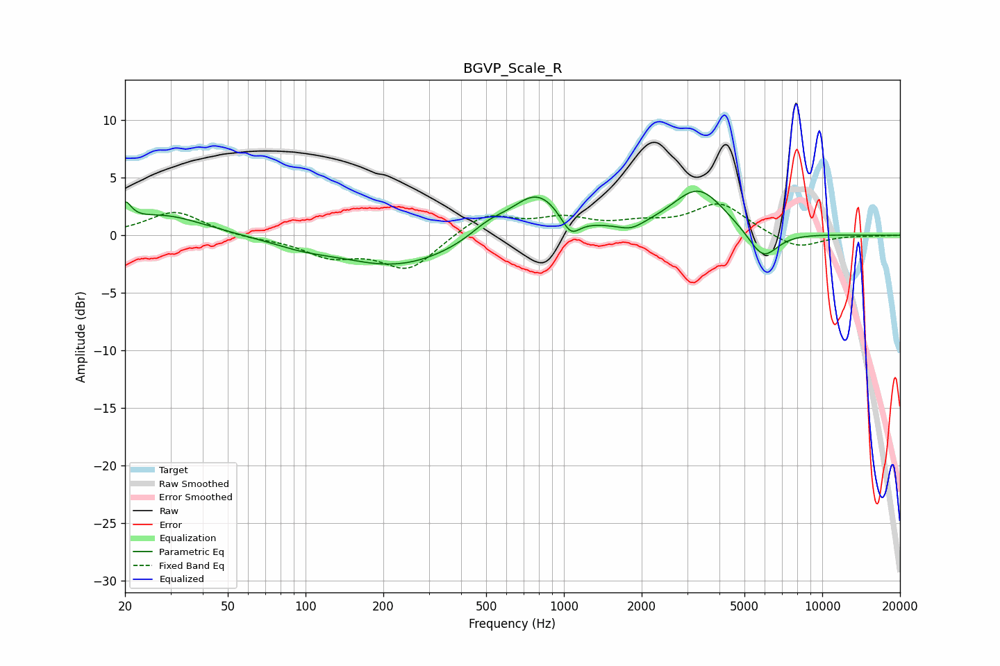

# BGVP_Scale_R
See [usage instructions](https://github.com/jaakkopasanen/AutoEq#usage) for more options and info.

### Parametric EQs
Apply preamp of -3.9 dB when using parametric equalizer.

|   # | Type    |   Fc (Hz) |    Q |   Gain (dB) |
|-----|---------|-----------|------|-------------|
|   1 | Peaking |        20 | 5.98 |         1.7 |
|   2 | Peaking |        28 | 0.89 |         1.8 |
|   3 | Peaking |        96 | 1.16 |        -0.5 |
|   4 | Peaking |       228 | 0.62 |        -2.7 |
|   5 | Peaking |       509 | 1.96 |         1   |
|   6 | Peaking |       787 | 1.37 |         3.8 |
|   7 | Peaking |      1061 | 3.82 |        -1.8 |
|   8 | Peaking |      1820 | 3.03 |        -0.6 |
|   9 | Peaking |      3314 | 1.36 |         4   |
|  10 | Peaking |      5898 | 2.38 |        -2.6 |

### Fixed Band EQs
When using fixed band (also called graphic) equalizer, apply preamp of **-2.8 dB** (if available) and set gains manually with these parameters.

|   # | Type    |   Fc (Hz) |    Q |   Gain (dB) |
|-----|---------|-----------|------|-------------|
|   1 | Peaking |        31 | 1.41 |         2.1 |
|   2 | Peaking |        62 | 1.41 |        -0.2 |
|   3 | Peaking |       125 | 1.41 |        -1.7 |
|   4 | Peaking |       250 | 1.41 |        -2.9 |
|   5 | Peaking |       500 | 1.41 |         1.9 |
|   6 | Peaking |      1000 | 1.41 |         1.3 |
|   7 | Peaking |      2000 | 1.41 |         0.8 |
|   8 | Peaking |      4000 | 1.41 |         2.7 |
|   9 | Peaking |      8000 | 1.41 |        -1.2 |
|  10 | Peaking |     16000 | 1.41 |        -0   |

### Graphs

