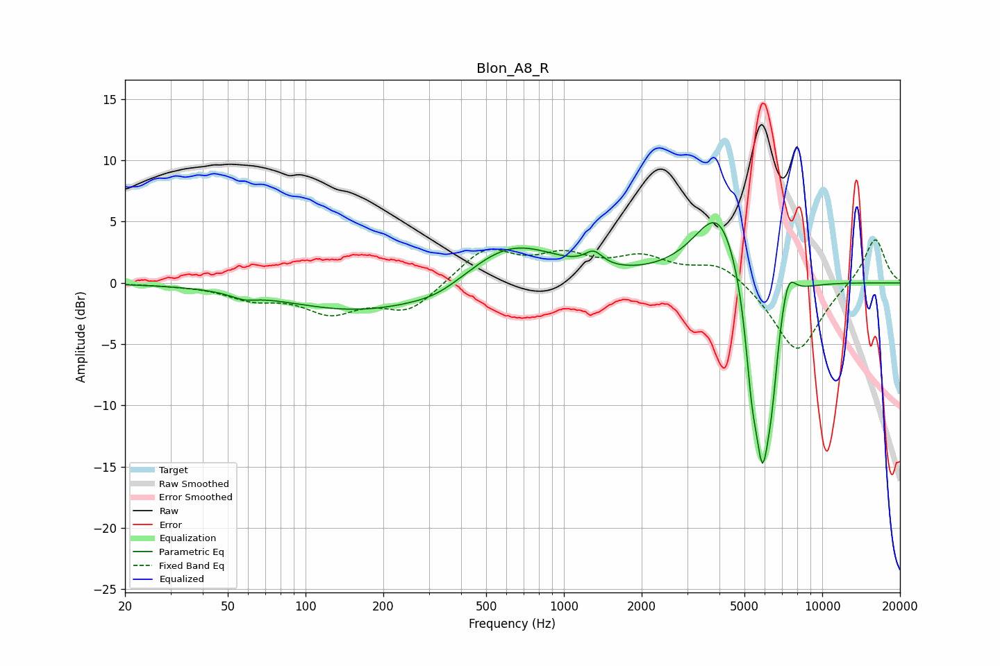

# Blon_A8_R
See [usage instructions](https://github.com/jaakkopasanen/AutoEq#usage) for more options and info.

### Parametric EQs
Apply preamp of -5.0 dB when using parametric equalizer.

|   # | Type    |   Fc (Hz) |    Q |   Gain (dB) |
|-----|---------|-----------|------|-------------|
|   1 | Peaking |        58 | 2.97 |        -0.4 |
|   2 | Peaking |       171 | 0.46 |        -2.4 |
|   3 | Peaking |       325 | 1.3  |        -0.7 |
|   4 | Peaking |       621 | 0.78 |         3.5 |
|   5 | Peaking |      1305 | 4.13 |         1.1 |
|   6 | Peaking |      4013 | 1.44 |         6.6 |
|   7 | Peaking |      5332 | 5.91 |        -4.8 |
|   8 | Peaking |      5871 | 3.74 |       -14.5 |
|   9 | Peaking |      6379 | 6    |        -3.6 |
|  10 | Peaking |      7356 | 4.54 |         2.8 |

### Fixed Band EQs
When using fixed band (also called graphic) equalizer, apply preamp of **-3.6 dB** (if available) and set gains manually with these parameters.

|   # | Type    |   Fc (Hz) |    Q |   Gain (dB) |
|-----|---------|-----------|------|-------------|
|   1 | Peaking |        31 | 1.41 |        -0.1 |
|   2 | Peaking |        62 | 1.41 |        -1.1 |
|   3 | Peaking |       125 | 1.41 |        -2.2 |
|   4 | Peaking |       250 | 1.41 |        -2.3 |
|   5 | Peaking |       500 | 1.41 |         2.8 |
|   6 | Peaking |      1000 | 1.41 |         1.9 |
|   7 | Peaking |      2000 | 1.41 |         1.8 |
|   8 | Peaking |      4000 | 1.41 |         1.7 |
|   9 | Peaking |      8000 | 1.41 |        -5.8 |
|  10 | Peaking |     16000 | 1.41 |         3.8 |

### Graphs

