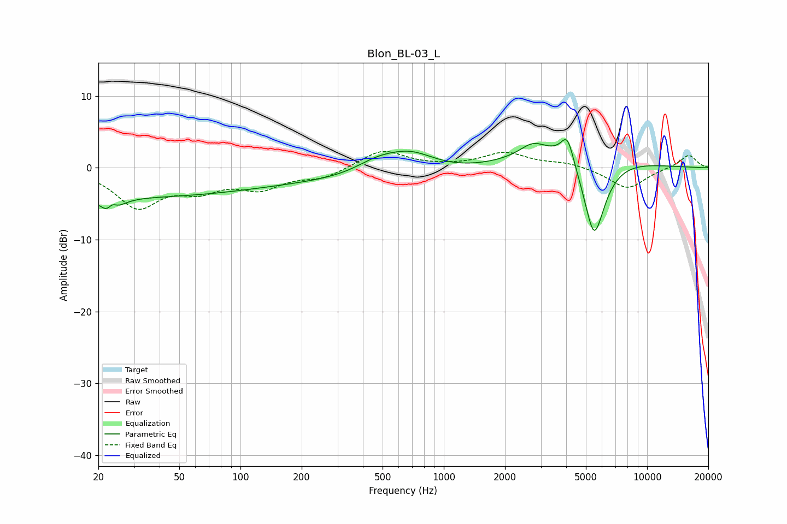

# Blon_BL-03_L
See [usage instructions](https://github.com/jaakkopasanen/AutoEq#usage) for more options and info.

### Parametric EQs
Apply preamp of -4.0 dB when using parametric equalizer.

|   # | Type    |   Fc (Hz) |    Q |   Gain (dB) |
|-----|---------|-----------|------|-------------|
|   1 | Peaking |        20 | 0.21 |        -3.8 |
|   2 | Peaking |        23 | 3.7  |        -4.3 |
|   3 | Peaking |        23 | 5.47 |         3   |
|   4 | Peaking |       326 | 0.2  |        -1.8 |
|   5 | Peaking |       467 | 1.31 |         1.6 |
|   6 | Peaking |       684 | 1.12 |         2.9 |
|   7 | Peaking |      2728 | 2.37 |         1.5 |
|   8 | Peaking |      4053 | 4.56 |         3.5 |
|   9 | Peaking |      4353 | 0.64 |         4.3 |
|  10 | Peaking |      5484 | 2.32 |       -12.9 |

### Fixed Band EQs
When using fixed band (also called graphic) equalizer, apply preamp of **-2.4 dB** (if available) and set gains manually with these parameters.

|   # | Type    |   Fc (Hz) |    Q |   Gain (dB) |
|-----|---------|-----------|------|-------------|
|   1 | Peaking |        31 | 1.41 |        -5.2 |
|   2 | Peaking |        62 | 1.41 |        -2.5 |
|   3 | Peaking |       125 | 1.41 |        -2.5 |
|   4 | Peaking |       250 | 1.41 |        -1.3 |
|   5 | Peaking |       500 | 1.41 |         2.5 |
|   6 | Peaking |      1000 | 1.41 |         0.1 |
|   7 | Peaking |      2000 | 1.41 |         2   |
|   8 | Peaking |      4000 | 1.41 |         0.7 |
|   9 | Peaking |      8000 | 1.41 |        -2.9 |
|  10 | Peaking |     16000 | 1.41 |         1.8 |

### Graphs

