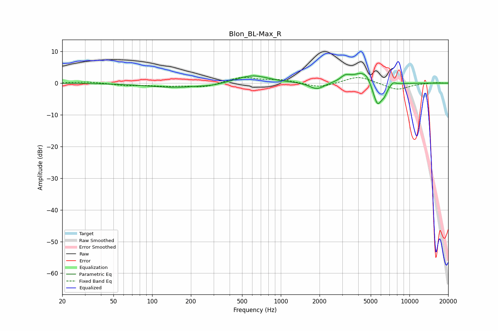

# Blon_BL-Max_R
See [usage instructions](https://github.com/jaakkopasanen/AutoEq#usage) for more options and info.

### Parametric EQs
Apply preamp of -3.1 dB when using parametric equalizer.

|   # | Type    |   Fc (Hz) |    Q |   Gain (dB) |
|-----|---------|-----------|------|-------------|
|   1 | Peaking |       154 | 0.63 |        -1.4 |
|   2 | Peaking |       294 | 1.94 |        -0.4 |
|   3 | Peaking |       603 | 1.16 |         2.5 |
|   4 | Peaking |      1908 | 2.59 |        -2.1 |
|   5 | Peaking |      3177 | 3.59 |         1.8 |
|   6 | Peaking |      4214 | 2.11 |         3.3 |
|   7 | Peaking |      4668 | 4.62 |         1.3 |
|   8 | Peaking |      5643 | 3.76 |        -7.4 |
|   9 | Peaking |      6367 | 6    |        -1.9 |
|  10 | Peaking |      7457 | 5.99 |         1   |

### Fixed Band EQs
When using fixed band (also called graphic) equalizer, apply preamp of **-1.9 dB** (if available) and set gains manually with these parameters.

|   # | Type    |   Fc (Hz) |    Q |   Gain (dB) |
|-----|---------|-----------|------|-------------|
|   1 | Peaking |        31 | 1.41 |         0.5 |
|   2 | Peaking |        62 | 1.41 |        -0.7 |
|   3 | Peaking |       125 | 1.41 |        -0.8 |
|   4 | Peaking |       250 | 1.41 |        -1.3 |
|   5 | Peaking |       500 | 1.41 |         1.9 |
|   6 | Peaking |      1000 | 1.41 |         1   |
|   7 | Peaking |      2000 | 1.41 |        -1.5 |
|   8 | Peaking |      4000 | 1.41 |         2.3 |
|   9 | Peaking |      8000 | 1.41 |        -2.2 |
|  10 | Peaking |     16000 | 1.41 |         0.2 |

### Graphs

