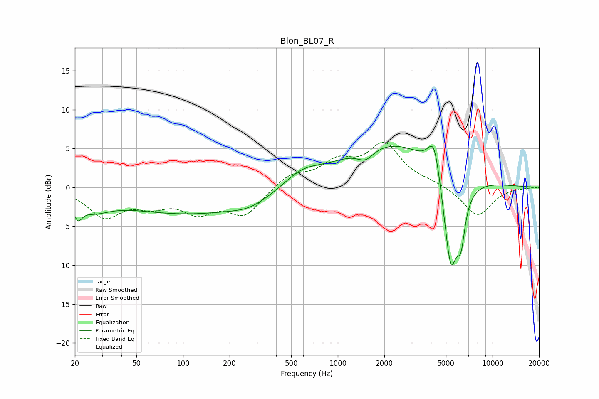

# Blon_BL07_R
See [usage instructions](https://github.com/jaakkopasanen/AutoEq#usage) for more options and info.

### Parametric EQs
Apply preamp of -5.4 dB when using parametric equalizer.

|   # | Type    |   Fc (Hz) |    Q |   Gain (dB) |
|-----|---------|-----------|------|-------------|
|   1 | Peaking |        21 | 5.46 |        -1.9 |
|   2 | Peaking |        26 | 1.28 |        -1.9 |
|   3 | Peaking |       107 | 0.33 |        -3.3 |
|   4 | Peaking |       274 | 1.12 |        -1   |
|   5 | Peaking |       586 | 1.25 |         1.6 |
|   6 | Peaking |      1512 | 2.67 |        -1.5 |
|   7 | Peaking |      2315 | 0.41 |         5.9 |
|   8 | Peaking |      4203 | 3.42 |         5.3 |
|   9 | Peaking |      5374 | 2.64 |       -13.5 |
|  10 | Peaking |      6258 | 5.65 |        -4.4 |

### Fixed Band EQs
When using fixed band (also called graphic) equalizer, apply preamp of **-5.9 dB** (if available) and set gains manually with these parameters.

|   # | Type    |   Fc (Hz) |    Q |   Gain (dB) |
|-----|---------|-----------|------|-------------|
|   1 | Peaking |        31 | 1.41 |        -3.6 |
|   2 | Peaking |        62 | 1.41 |        -1.8 |
|   3 | Peaking |       125 | 1.41 |        -2.8 |
|   4 | Peaking |       250 | 1.41 |        -3.4 |
|   5 | Peaking |       500 | 1.41 |         1.7 |
|   6 | Peaking |      1000 | 1.41 |         2.9 |
|   7 | Peaking |      2000 | 1.41 |         5.3 |
|   8 | Peaking |      4000 | 1.41 |         0.5 |
|   9 | Peaking |      8000 | 1.41 |        -3.7 |
|  10 | Peaking |     16000 | 1.41 |        -0   |

### Graphs

