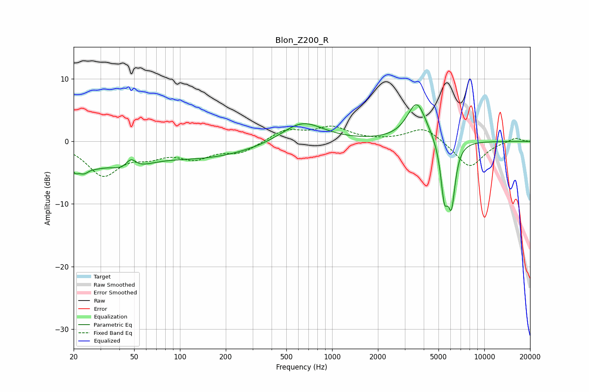

# Blon_Z200_R
See [usage instructions](https://github.com/jaakkopasanen/AutoEq#usage) for more options and info.

### Parametric EQs
Apply preamp of -6.0 dB when using parametric equalizer.

|   # | Type    |   Fc (Hz) |    Q |   Gain (dB) |
|-----|---------|-----------|------|-------------|
|   1 | Peaking |        20 | 4.78 |        -2.5 |
|   2 | Peaking |        23 | 4.04 |        -1.7 |
|   3 | Peaking |        28 | 1.76 |        -1.8 |
|   4 | Peaking |        45 | 1.16 |        -3.2 |
|   5 | Peaking |        48 | 4.08 |         1.9 |
|   6 | Peaking |       140 | 0.39 |        -2.6 |
|   7 | Peaking |       635 | 1.03 |         3.5 |
|   8 | Peaking |      3601 | 2.22 |         6.3 |
|   9 | Peaking |      5462 | 5.8  |        -8   |
|  10 | Peaking |      6089 | 5.51 |        -9.1 |

### Fixed Band EQs
When using fixed band (also called graphic) equalizer, apply preamp of **-2.6 dB** (if available) and set gains manually with these parameters.

|   # | Type    |   Fc (Hz) |    Q |   Gain (dB) |
|-----|---------|-----------|------|-------------|
|   1 | Peaking |        31 | 1.41 |        -5.2 |
|   2 | Peaking |        62 | 1.41 |        -1.8 |
|   3 | Peaking |       125 | 1.41 |        -2.3 |
|   4 | Peaking |       250 | 1.41 |        -1.7 |
|   5 | Peaking |       500 | 1.41 |         1.8 |
|   6 | Peaking |      1000 | 1.41 |         2.1 |
|   7 | Peaking |      2000 | 1.41 |         0   |
|   8 | Peaking |      4000 | 1.41 |         2.4 |
|   9 | Peaking |      8000 | 1.41 |        -4.2 |
|  10 | Peaking |     16000 | 1.41 |         0.7 |

### Graphs

