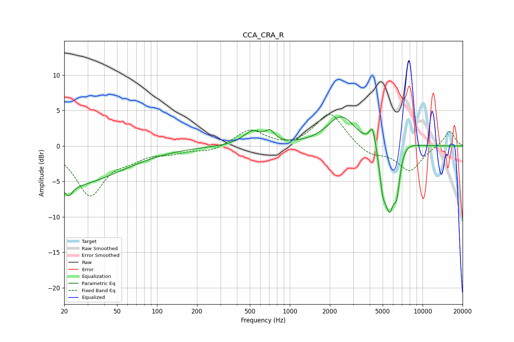

# CCA_CRA_R
See [usage instructions](https://github.com/jaakkopasanen/AutoEq#usage) for more options and info.

### Parametric EQs
Apply preamp of -4.2 dB when using parametric equalizer.

|   # | Type    |   Fc (Hz) |    Q |   Gain (dB) |
|-----|---------|-----------|------|-------------|
|   1 | Peaking |        20 | 0.34 |        -5.6 |
|   2 | Peaking |        22 | 5.15 |        -1.4 |
|   3 | Peaking |       525 | 1.97 |         2   |
|   4 | Peaking |       711 | 4.24 |         1.3 |
|   5 | Peaking |      2442 | 1.34 |         4.2 |
|   6 | Peaking |      4204 | 5.72 |         3   |
|   7 | Peaking |      5006 | 6    |        -3.8 |
|   8 | Peaking |      5633 | 3.54 |        -8.5 |
|   9 | Peaking |      6400 | 5.98 |        -4.5 |
|  10 | Peaking |      7188 | 1.71 |         1.2 |

### Fixed Band EQs
When using fixed band (also called graphic) equalizer, apply preamp of **-4.6 dB** (if available) and set gains manually with these parameters.

|   # | Type    |   Fc (Hz) |    Q |   Gain (dB) |
|-----|---------|-----------|------|-------------|
|   1 | Peaking |        31 | 1.41 |        -6.8 |
|   2 | Peaking |        62 | 1.41 |        -1.3 |
|   3 | Peaking |       125 | 1.41 |        -0.8 |
|   4 | Peaking |       250 | 1.41 |        -0.7 |
|   5 | Peaking |       500 | 1.41 |         2.3 |
|   6 | Peaking |      1000 | 1.41 |        -0.3 |
|   7 | Peaking |      2000 | 1.41 |         4.8 |
|   8 | Peaking |      4000 | 1.41 |        -1.4 |
|   9 | Peaking |      8000 | 1.41 |        -3.5 |
|  10 | Peaking |     16000 | 1.41 |         2.2 |

### Graphs

