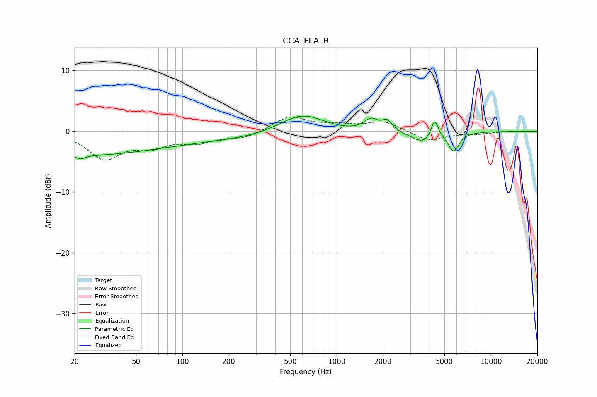

# CCA_FLA_R
See [usage instructions](https://github.com/jaakkopasanen/AutoEq#usage) for more options and info.

### Parametric EQs
Apply preamp of -2.6 dB when using parametric equalizer.

|   # | Type    |   Fc (Hz) |    Q |   Gain (dB) |
|-----|---------|-----------|------|-------------|
|   1 | Peaking |        20 | 0.27 |        -3.9 |
|   2 | Peaking |        22 | 5.79 |        -3.6 |
|   3 | Peaking |        22 | 5.88 |         3.1 |
|   4 | Peaking |       294 | 0.24 |        -1.4 |
|   5 | Peaking |       596 | 0.92 |         3.7 |
|   6 | Peaking |      1674 | 3.08 |         1.9 |
|   7 | Peaking |      2127 | 4.42 |         1.6 |
|   8 | Peaking |      3652 | 1.94 |        -1.9 |
|   9 | Peaking |      4316 | 5.98 |         3.2 |
|  10 | Peaking |      5737 | 3.97 |        -3.1 |

### Fixed Band EQs
When using fixed band (also called graphic) equalizer, apply preamp of **-2.5 dB** (if available) and set gains manually with these parameters.

|   # | Type    |   Fc (Hz) |    Q |   Gain (dB) |
|-----|---------|-----------|------|-------------|
|   1 | Peaking |        31 | 1.41 |        -4.3 |
|   2 | Peaking |        62 | 1.41 |        -2.1 |
|   3 | Peaking |       125 | 1.41 |        -1.6 |
|   4 | Peaking |       250 | 1.41 |        -1.1 |
|   5 | Peaking |       500 | 1.41 |         2.4 |
|   6 | Peaking |      1000 | 1.41 |         0.8 |
|   7 | Peaking |      2000 | 1.41 |         1.6 |
|   8 | Peaking |      4000 | 1.41 |        -1.6 |
|   9 | Peaking |      8000 | 1.41 |        -0.4 |
|  10 | Peaking |     16000 | 1.41 |         0.1 |

### Graphs

