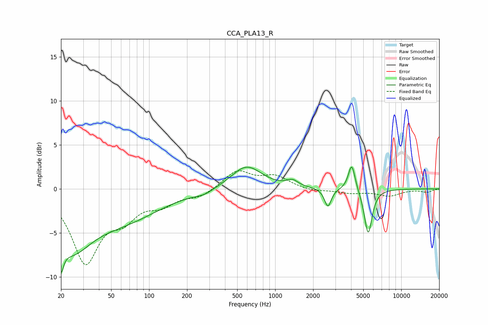

# CCA_PLA13_R
See [usage instructions](https://github.com/jaakkopasanen/AutoEq#usage) for more options and info.

### Parametric EQs
Apply preamp of -2.6 dB when using parametric equalizer.

|   # | Type    |   Fc (Hz) |    Q |   Gain (dB) |
|-----|---------|-----------|------|-------------|
|   1 | Peaking |        20 | 5.57 |        -7   |
|   2 | Peaking |        20 | 5.21 |         3.7 |
|   3 | Peaking |        24 | 0.9  |        -5.6 |
|   4 | Peaking |        61 | 0.47 |        -3.2 |
|   5 | Peaking |       273 | 1.92 |        -0.4 |
|   6 | Peaking |       592 | 1.18 |         2.7 |
|   7 | Peaking |      1371 | 3.13 |         0.7 |
|   8 | Peaking |      2619 | 5.33 |        -2.1 |
|   9 | Peaking |      4048 | 5.26 |         3.1 |
|  10 | Peaking |      5466 | 4.55 |        -5.2 |

### Fixed Band EQs
When using fixed band (also called graphic) equalizer, apply preamp of **-2.2 dB** (if available) and set gains manually with these parameters.

|   # | Type    |   Fc (Hz) |    Q |   Gain (dB) |
|-----|---------|-----------|------|-------------|
|   1 | Peaking |        31 | 1.41 |        -8.1 |
|   2 | Peaking |        62 | 1.41 |        -2.6 |
|   3 | Peaking |       125 | 1.41 |        -1.5 |
|   4 | Peaking |       250 | 1.41 |        -0.8 |
|   5 | Peaking |       500 | 1.41 |         2   |
|   6 | Peaking |      1000 | 1.41 |         1.3 |
|   7 | Peaking |      2000 | 1.41 |        -0.3 |
|   8 | Peaking |      4000 | 1.41 |        -0.4 |
|   9 | Peaking |      8000 | 1.41 |        -0.8 |
|  10 | Peaking |     16000 | 1.41 |        -0.4 |

### Graphs

