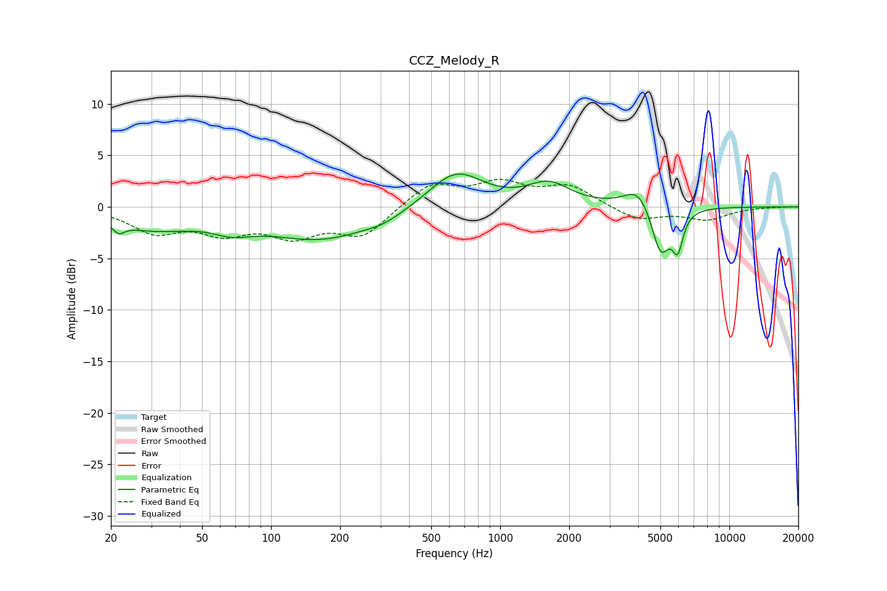

# CCZ_Melody_R
See [usage instructions](https://github.com/jaakkopasanen/AutoEq#usage) for more options and info.

### Parametric EQs
Apply preamp of -3.3 dB when using parametric equalizer.

|   # | Type    |   Fc (Hz) |    Q |   Gain (dB) |
|-----|---------|-----------|------|-------------|
|   1 | Peaking |        22 | 5.92 |        -0.9 |
|   2 | Peaking |        30 | 0.76 |        -1.9 |
|   3 | Peaking |        68 | 1.63 |        -1.1 |
|   4 | Peaking |       166 | 0.58 |        -3.1 |
|   5 | Peaking |       311 | 1.89 |        -0.5 |
|   6 | Peaking |       639 | 1.18 |         3.6 |
|   7 | Peaking |      1629 | 1.52 |         2.1 |
|   8 | Peaking |      4006 | 2.37 |         2.1 |
|   9 | Peaking |      5016 | 3.46 |        -4.8 |
|  10 | Peaking |      5955 | 6    |        -3.3 |

### Fixed Band EQs
When using fixed band (also called graphic) equalizer, apply preamp of **-2.8 dB** (if available) and set gains manually with these parameters.

|   # | Type    |   Fc (Hz) |    Q |   Gain (dB) |
|-----|---------|-----------|------|-------------|
|   1 | Peaking |        31 | 1.41 |        -2.3 |
|   2 | Peaking |        62 | 1.41 |        -2.1 |
|   3 | Peaking |       125 | 1.41 |        -2.5 |
|   4 | Peaking |       250 | 1.41 |        -2.7 |
|   5 | Peaking |       500 | 1.41 |         2.3 |
|   6 | Peaking |      1000 | 1.41 |         2.1 |
|   7 | Peaking |      2000 | 1.41 |         1.9 |
|   8 | Peaking |      4000 | 1.41 |        -1.3 |
|   9 | Peaking |      8000 | 1.41 |        -1.2 |
|  10 | Peaking |     16000 | 1.41 |         0   |

### Graphs

