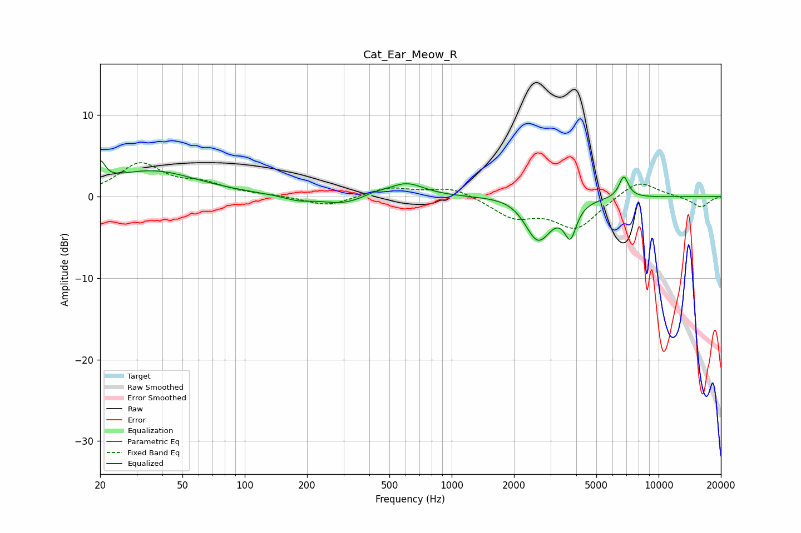

# Cat_Ear_Meow_R
See [usage instructions](https://github.com/jaakkopasanen/AutoEq#usage) for more options and info.

### Parametric EQs
Apply preamp of -4.5 dB when using parametric equalizer.

|   # | Type    |   Fc (Hz) |    Q |   Gain (dB) |
|-----|---------|-----------|------|-------------|
|   1 | Peaking |        20 | 5.99 |         2.4 |
|   2 | Peaking |        35 | 0.64 |         3.1 |
|   3 | Peaking |       180 | 2    |        -0.6 |
|   4 | Peaking |       298 | 1.38 |        -1   |
|   5 | Peaking |       425 | 2.71 |         0.4 |
|   6 | Peaking |       603 | 1.63 |         1.7 |
|   7 | Peaking |      2223 | 1.29 |         1.1 |
|   8 | Peaking |      2603 | 2.07 |        -6   |
|   9 | Peaking |      3746 | 4.88 |        -3.9 |
|  10 | Peaking |      6788 | 5.91 |         2.6 |

### Fixed Band EQs
When using fixed band (also called graphic) equalizer, apply preamp of **-4.2 dB** (if available) and set gains manually with these parameters.

|   # | Type    |   Fc (Hz) |    Q |   Gain (dB) |
|-----|---------|-----------|------|-------------|
|   1 | Peaking |        31 | 1.41 |         3.9 |
|   2 | Peaking |        62 | 1.41 |         1.3 |
|   3 | Peaking |       125 | 1.41 |         0.1 |
|   4 | Peaking |       250 | 1.41 |        -1.2 |
|   5 | Peaking |       500 | 1.41 |         1.1 |
|   6 | Peaking |      1000 | 1.41 |         1.2 |
|   7 | Peaking |      2000 | 1.41 |        -2.4 |
|   8 | Peaking |      4000 | 1.41 |        -3.8 |
|   9 | Peaking |      8000 | 1.41 |         2.2 |
|  10 | Peaking |     16000 | 1.41 |        -1.3 |

### Graphs

