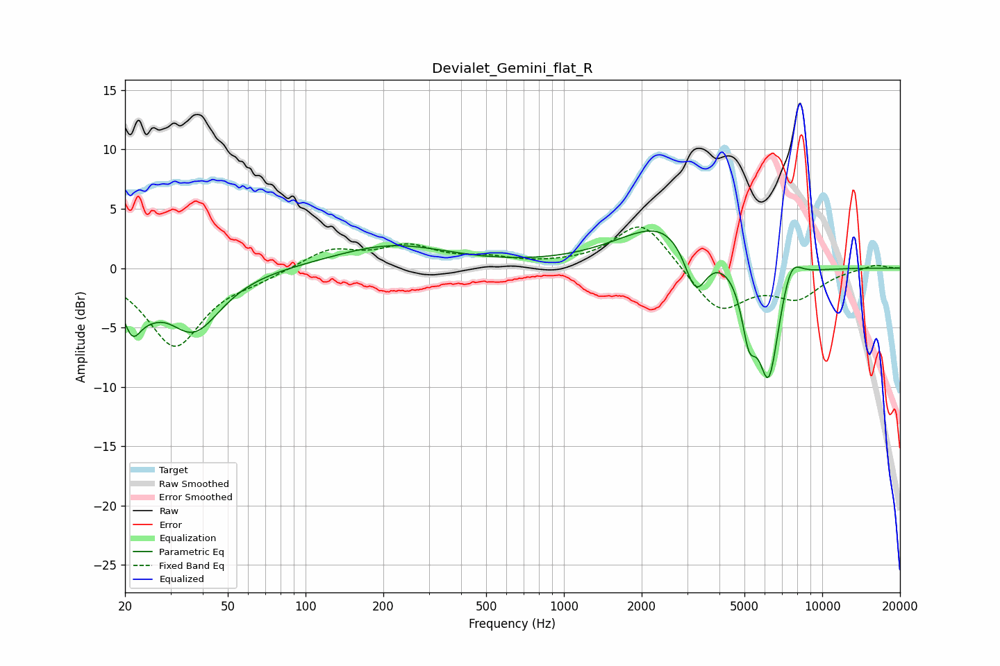

# Devialet_Gemini_flat_R
See [usage instructions](https://github.com/jaakkopasanen/AutoEq#usage) for more options and info.

### Parametric EQs
Apply preamp of -3.2 dB when using parametric equalizer.

|   # | Type    |   Fc (Hz) |    Q |   Gain (dB) |
|-----|---------|-----------|------|-------------|
|   1 | Peaking |        21 | 3.76 |        -3.7 |
|   2 | Peaking |        24 | 2.94 |         1.3 |
|   3 | Peaking |        25 | 2.86 |        -2.2 |
|   4 | Peaking |        37 | 1.34 |        -5.2 |
|   5 | Peaking |       216 | 0.64 |         1.9 |
|   6 | Peaking |      2550 | 0.78 |         4.1 |
|   7 | Peaking |      3232 | 3.12 |        -4.5 |
|   8 | Peaking |      5202 | 4.88 |        -4.5 |
|   9 | Peaking |      6206 | 3.14 |        -9.8 |
|  10 | Peaking |      7555 | 3.37 |         2.5 |

### Fixed Band EQs
When using fixed band (also called graphic) equalizer, apply preamp of **-3.6 dB** (if available) and set gains manually with these parameters.

|   # | Type    |   Fc (Hz) |    Q |   Gain (dB) |
|-----|---------|-----------|------|-------------|
|   1 | Peaking |        31 | 1.41 |        -6.5 |
|   2 | Peaking |        62 | 1.41 |        -0.7 |
|   3 | Peaking |       125 | 1.41 |         1.6 |
|   4 | Peaking |       250 | 1.41 |         1.7 |
|   5 | Peaking |       500 | 1.41 |         0.7 |
|   6 | Peaking |      1000 | 1.41 |         0.1 |
|   7 | Peaking |      2000 | 1.41 |         4.1 |
|   8 | Peaking |      4000 | 1.41 |        -3.7 |
|   9 | Peaking |      8000 | 1.41 |        -2.3 |
|  10 | Peaking |     16000 | 1.41 |         0.4 |

### Graphs

