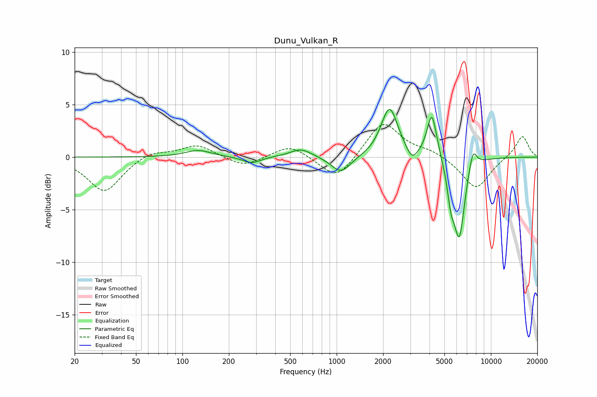

# Dunu_Vulkan_R
See [usage instructions](https://github.com/jaakkopasanen/AutoEq#usage) for more options and info.

### Parametric EQs
Apply preamp of -4.6 dB when using parametric equalizer.

|   # | Type    |   Fc (Hz) |    Q |   Gain (dB) |
|-----|---------|-----------|------|-------------|
|   1 | Peaking |       127 | 1.72 |         0.6 |
|   2 | Peaking |       281 | 2.45 |        -0.6 |
|   3 | Peaking |       587 | 2.03 |         0.8 |
|   4 | Peaking |      1066 | 2.23 |        -1.6 |
|   5 | Peaking |      2202 | 2.6  |         4.7 |
|   6 | Peaking |      3082 | 3.99 |        -1.2 |
|   7 | Peaking |      4147 | 4.42 |         4.4 |
|   8 | Peaking |      5505 | 5.99 |        -2.6 |
|   9 | Peaking |      6237 | 3.81 |        -7.5 |
|  10 | Peaking |      7643 | 5.27 |         1.9 |

### Fixed Band EQs
When using fixed band (also called graphic) equalizer, apply preamp of **-3.2 dB** (if available) and set gains manually with these parameters.

|   # | Type    |   Fc (Hz) |    Q |   Gain (dB) |
|-----|---------|-----------|------|-------------|
|   1 | Peaking |        31 | 1.41 |        -3.3 |
|   2 | Peaking |        62 | 1.41 |         0.7 |
|   3 | Peaking |       125 | 1.41 |         1.2 |
|   4 | Peaking |       250 | 1.41 |        -1   |
|   5 | Peaking |       500 | 1.41 |         1.2 |
|   6 | Peaking |      1000 | 1.41 |        -2.3 |
|   7 | Peaking |      2000 | 1.41 |         3.5 |
|   8 | Peaking |      4000 | 1.41 |         0.6 |
|   9 | Peaking |      8000 | 1.41 |        -3.1 |
|  10 | Peaking |     16000 | 1.41 |         2.1 |

### Graphs

