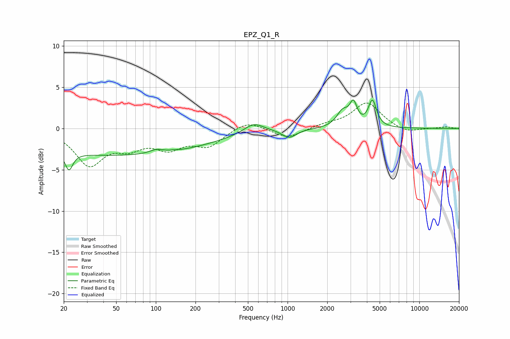

# EPZ_Q1_R
See [usage instructions](https://github.com/jaakkopasanen/AutoEq#usage) for more options and info.

### Parametric EQs
Apply preamp of -3.6 dB when using parametric equalizer.

|   # | Type    |   Fc (Hz) |    Q |   Gain (dB) |
|-----|---------|-----------|------|-------------|
|   1 | Peaking |        22 | 4.98 |        -2.2 |
|   2 | Peaking |        53 | 0.18 |        -3.2 |
|   3 | Peaking |       101 | 2.67 |         0.5 |
|   4 | Peaking |       137 | 5.74 |         0.1 |
|   5 | Peaking |       554 | 1.86 |         1.2 |
|   6 | Peaking |      1028 | 2.65 |        -1   |
|   7 | Peaking |      2619 | 3.14 |         1.8 |
|   8 | Peaking |      3160 | 5.11 |         2.5 |
|   9 | Peaking |      4403 | 4.65 |         3.2 |
|  10 | Peaking |      9894 | 6    |         0   |

### Fixed Band EQs
When using fixed band (also called graphic) equalizer, apply preamp of **-3.2 dB** (if available) and set gains manually with these parameters.

|   # | Type    |   Fc (Hz) |    Q |   Gain (dB) |
|-----|---------|-----------|------|-------------|
|   1 | Peaking |        31 | 1.41 |        -4.2 |
|   2 | Peaking |        62 | 1.41 |        -1.8 |
|   3 | Peaking |       125 | 1.41 |        -2.1 |
|   4 | Peaking |       250 | 1.41 |        -2   |
|   5 | Peaking |       500 | 1.41 |         1.1 |
|   6 | Peaking |      1000 | 1.41 |        -1.2 |
|   7 | Peaking |      2000 | 1.41 |         0.4 |
|   8 | Peaking |      4000 | 1.41 |         3.1 |
|   9 | Peaking |      8000 | 1.41 |        -0.6 |
|  10 | Peaking |     16000 | 1.41 |         0.2 |

### Graphs

