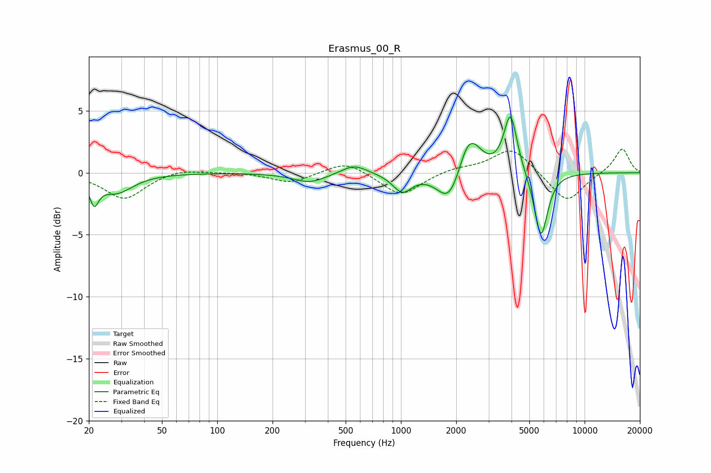

# Erasmus_00_R
See [usage instructions](https://github.com/jaakkopasanen/AutoEq#usage) for more options and info.

### Parametric EQs
Apply preamp of -4.6 dB when using parametric equalizer.

|   # | Type    |   Fc (Hz) |    Q |   Gain (dB) |
|-----|---------|-----------|------|-------------|
|   1 | Peaking |        21 | 5.84 |        -1.9 |
|   2 | Peaking |        28 | 1.57 |        -1.5 |
|   3 | Peaking |       319 | 1.56 |        -0.8 |
|   4 | Peaking |       555 | 2.04 |         0.8 |
|   5 | Peaking |      1016 | 2.76 |        -1.5 |
|   6 | Peaking |      1836 | 2.19 |        -2.7 |
|   7 | Peaking |      2368 | 2.56 |         3.7 |
|   8 | Peaking |      2412 | 4.73 |        -0.4 |
|   9 | Peaking |      3948 | 3.95 |         4.8 |
|  10 | Peaking |      5785 | 3.77 |        -5.3 |

### Fixed Band EQs
When using fixed band (also called graphic) equalizer, apply preamp of **-2.0 dB** (if available) and set gains manually with these parameters.

|   # | Type    |   Fc (Hz) |    Q |   Gain (dB) |
|-----|---------|-----------|------|-------------|
|   1 | Peaking |        31 | 1.41 |        -2.1 |
|   2 | Peaking |        62 | 1.41 |         0.4 |
|   3 | Peaking |       125 | 1.41 |         0.1 |
|   4 | Peaking |       250 | 1.41 |        -0.8 |
|   5 | Peaking |       500 | 1.41 |         1   |
|   6 | Peaking |      1000 | 1.41 |        -1.9 |
|   7 | Peaking |      2000 | 1.41 |         0.4 |
|   8 | Peaking |      4000 | 1.41 |         2.1 |
|   9 | Peaking |      8000 | 1.41 |        -2.5 |
|  10 | Peaking |     16000 | 1.41 |         2   |

### Graphs

