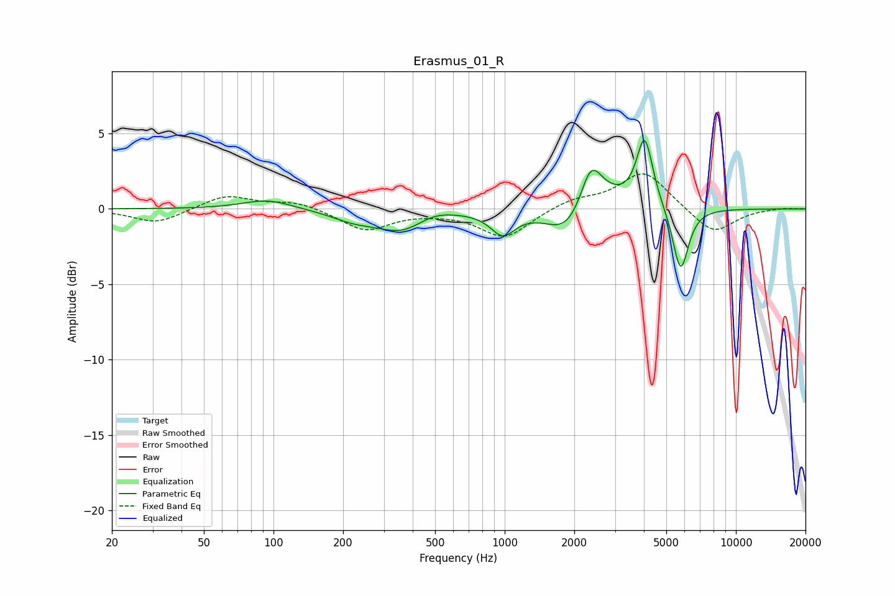

# Erasmus_01_R
See [usage instructions](https://github.com/jaakkopasanen/AutoEq#usage) for more options and info.

### Parametric EQs
Apply preamp of -4.6 dB when using parametric equalizer.

|   # | Type    |   Fc (Hz) |    Q |   Gain (dB) |
|-----|---------|-----------|------|-------------|
|   1 | Peaking |        94 | 1.33 |         0.6 |
|   2 | Peaking |       222 | 1.42 |        -0.6 |
|   3 | Peaking |       361 | 1.28 |        -1.4 |
|   4 | Peaking |       492 | 1.68 |         0.5 |
|   5 | Peaking |       982 | 2.7  |        -1.5 |
|   6 | Peaking |      1878 | 1.59 |        -2   |
|   7 | Peaking |      2354 | 3.13 |         2.6 |
|   8 | Peaking |      2603 | 1.51 |         1.1 |
|   9 | Peaking |      4031 | 3.99 |         4.6 |
|  10 | Peaking |      5765 | 4.05 |        -4.3 |

### Fixed Band EQs
When using fixed band (also called graphic) equalizer, apply preamp of **-2.4 dB** (if available) and set gains manually with these parameters.

|   # | Type    |   Fc (Hz) |    Q |   Gain (dB) |
|-----|---------|-----------|------|-------------|
|   1 | Peaking |        31 | 1.41 |        -1   |
|   2 | Peaking |        62 | 1.41 |         0.9 |
|   3 | Peaking |       125 | 1.41 |         0.5 |
|   4 | Peaking |       250 | 1.41 |        -1.4 |
|   5 | Peaking |       500 | 1.41 |        -0.1 |
|   6 | Peaking |      1000 | 1.41 |        -1.9 |
|   7 | Peaking |      2000 | 1.41 |         0.6 |
|   8 | Peaking |      4000 | 1.41 |         2.5 |
|   9 | Peaking |      8000 | 1.41 |        -1.7 |
|  10 | Peaking |     16000 | 1.41 |         0.1 |

### Graphs

