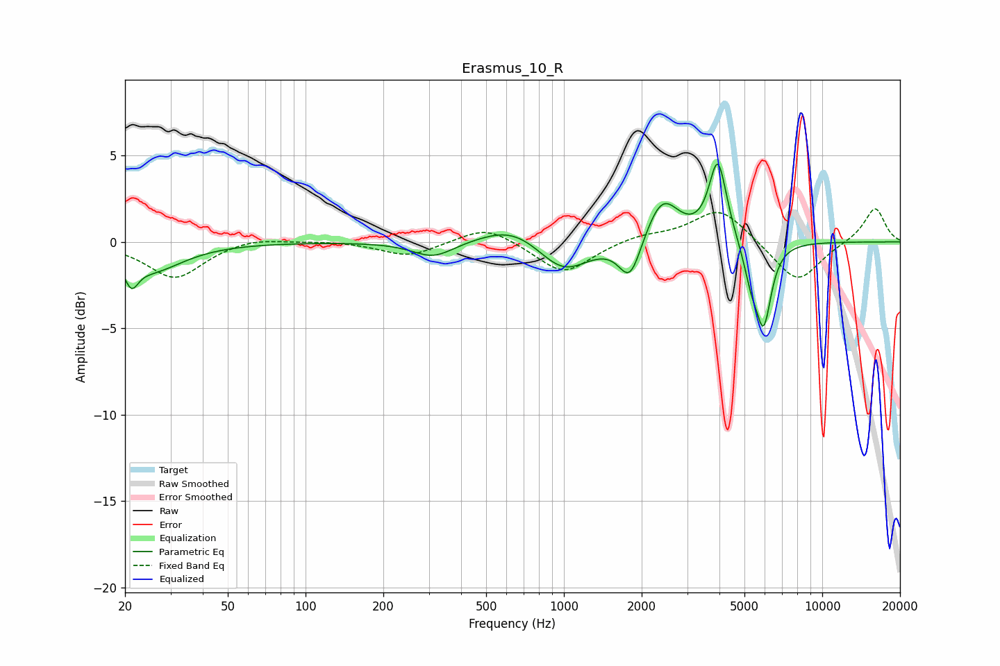

# Erasmus_10_R
See [usage instructions](https://github.com/jaakkopasanen/AutoEq#usage) for more options and info.

### Parametric EQs
Apply preamp of -4.6 dB when using parametric equalizer.

|   # | Type    |   Fc (Hz) |    Q |   Gain (dB) |
|-----|---------|-----------|------|-------------|
|   1 | Peaking |        21 | 5.65 |        -1.3 |
|   2 | Peaking |        25 | 1.15 |        -1.6 |
|   3 | Peaking |       312 | 1.75 |        -0.9 |
|   4 | Peaking |       634 | 1.16 |         1.1 |
|   5 | Peaking |       996 | 1.43 |        -1.9 |
|   6 | Peaking |      1805 | 3.28 |        -2.4 |
|   7 | Peaking |      2402 | 2.2  |         2.6 |
|   8 | Peaking |      3944 | 4.15 |         4.6 |
|   9 | Peaking |      5294 | 4.79 |        -1.7 |
|  10 | Peaking |      5930 | 4.61 |        -4.6 |

### Fixed Band EQs
When using fixed band (also called graphic) equalizer, apply preamp of **-2.0 dB** (if available) and set gains manually with these parameters.

|   # | Type    |   Fc (Hz) |    Q |   Gain (dB) |
|-----|---------|-----------|------|-------------|
|   1 | Peaking |        31 | 1.41 |        -2.1 |
|   2 | Peaking |        62 | 1.41 |         0.3 |
|   3 | Peaking |       125 | 1.41 |         0.1 |
|   4 | Peaking |       250 | 1.41 |        -0.8 |
|   5 | Peaking |       500 | 1.41 |         1   |
|   6 | Peaking |      1000 | 1.41 |        -1.9 |
|   7 | Peaking |      2000 | 1.41 |         0.4 |
|   8 | Peaking |      4000 | 1.41 |         2   |
|   9 | Peaking |      8000 | 1.41 |        -2.4 |
|  10 | Peaking |     16000 | 1.41 |         2   |

### Graphs

