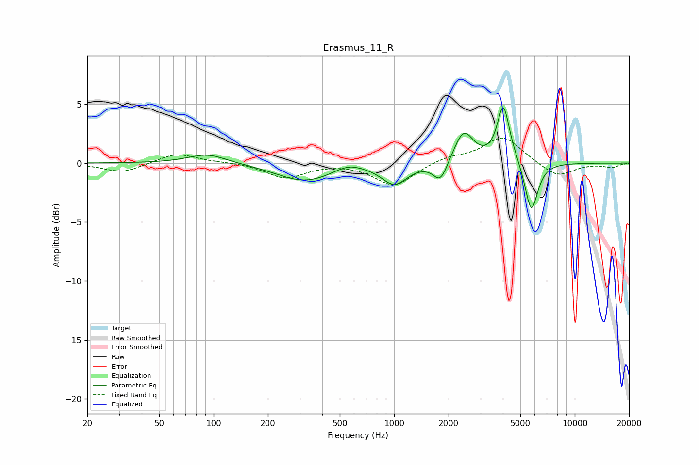

# Erasmus_11_R
See [usage instructions](https://github.com/jaakkopasanen/AutoEq#usage) for more options and info.

### Parametric EQs
Apply preamp of -4.8 dB when using parametric equalizer.

|   # | Type    |   Fc (Hz) |    Q |   Gain (dB) |
|-----|---------|-----------|------|-------------|
|   1 | Peaking |        93 | 1.32 |         0.8 |
|   2 | Peaking |       318 | 0.92 |        -1.5 |
|   3 | Peaking |       514 | 1.38 |        -0.2 |
|   4 | Peaking |       551 | 1.7  |         0.8 |
|   5 | Peaking |      1003 | 2.01 |        -1.7 |
|   6 | Peaking |      1804 | 3.6  |        -1.7 |
|   7 | Peaking |      2426 | 2.65 |         2.7 |
|   8 | Peaking |      4017 | 4.41 |         4.4 |
|   9 | Peaking |      4314 | 2.26 |         0.6 |
|  10 | Peaking |      5744 | 3.87 |        -4.4 |

### Fixed Band EQs
When using fixed band (also called graphic) equalizer, apply preamp of **-2.2 dB** (if available) and set gains manually with these parameters.

|   # | Type    |   Fc (Hz) |    Q |   Gain (dB) |
|-----|---------|-----------|------|-------------|
|   1 | Peaking |        31 | 1.41 |        -0.8 |
|   2 | Peaking |        62 | 1.41 |         0.9 |
|   3 | Peaking |       125 | 1.41 |         0.1 |
|   4 | Peaking |       250 | 1.41 |        -1.2 |
|   5 | Peaking |       500 | 1.41 |         0.1 |
|   6 | Peaking |      1000 | 1.41 |        -2   |
|   7 | Peaking |      2000 | 1.41 |         0.5 |
|   8 | Peaking |      4000 | 1.41 |         2.3 |
|   9 | Peaking |      8000 | 1.41 |        -1.2 |
|  10 | Peaking |     16000 | 1.41 |        -0.3 |

### Graphs

