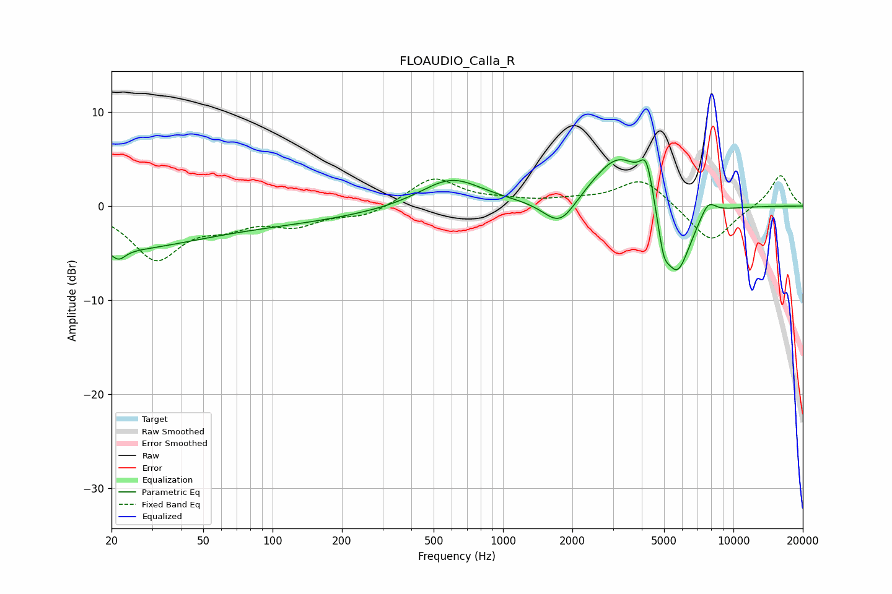

# FLOAUDIO_Calla_R
See [usage instructions](https://github.com/jaakkopasanen/AutoEq#usage) for more options and info.

### Parametric EQs
Apply preamp of -5.0 dB when using parametric equalizer.

|   # | Type    |   Fc (Hz) |    Q |   Gain (dB) |
|-----|---------|-----------|------|-------------|
|   1 | Peaking |        20 | 0.4  |        -4.3 |
|   2 | Peaking |        21 | 4.99 |        -1.1 |
|   3 | Peaking |       114 | 0.38 |        -1.4 |
|   4 | Peaking |       596 | 1.05 |         3   |
|   5 | Peaking |      1767 | 1.95 |        -3.2 |
|   6 | Peaking |      3211 | 1.18 |         5.9 |
|   7 | Peaking |      4196 | 4.78 |         3.9 |
|   8 | Peaking |      4974 | 5.84 |        -2.9 |
|   9 | Peaking |      5680 | 2.15 |        -8.3 |
|  10 | Peaking |      7754 | 3.81 |         1.7 |

### Fixed Band EQs
When using fixed band (also called graphic) equalizer, apply preamp of **-3.3 dB** (if available) and set gains manually with these parameters.

|   # | Type    |   Fc (Hz) |    Q |   Gain (dB) |
|-----|---------|-----------|------|-------------|
|   1 | Peaking |        31 | 1.41 |        -5.5 |
|   2 | Peaking |        62 | 1.41 |        -1.6 |
|   3 | Peaking |       125 | 1.41 |        -1.8 |
|   4 | Peaking |       250 | 1.41 |        -1.1 |
|   5 | Peaking |       500 | 1.41 |         3   |
|   6 | Peaking |      1000 | 1.41 |         0.4 |
|   7 | Peaking |      2000 | 1.41 |         0.5 |
|   8 | Peaking |      4000 | 1.41 |         3   |
|   9 | Peaking |      8000 | 1.41 |        -4   |
|  10 | Peaking |     16000 | 1.41 |         3.4 |

### Graphs

