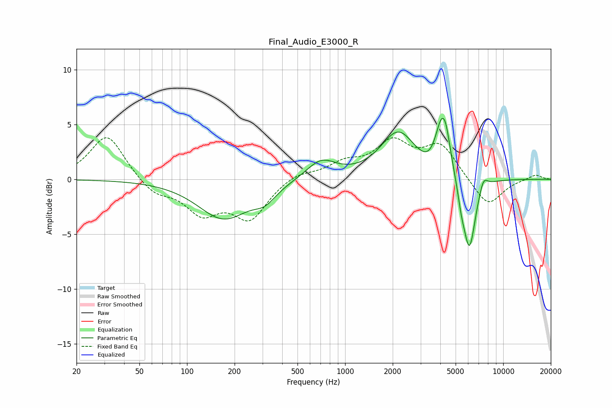

# Final_Audio_E3000_R
See [usage instructions](https://github.com/jaakkopasanen/AutoEq#usage) for more options and info.

### Parametric EQs
Apply preamp of -5.7 dB when using parametric equalizer.

|   # | Type    |   Fc (Hz) |    Q |   Gain (dB) |
|-----|---------|-----------|------|-------------|
|   1 | Peaking |       171 | 0.88 |        -3.5 |
|   2 | Peaking |       311 | 2.02 |        -1.1 |
|   3 | Peaking |       705 | 1.51 |         1.8 |
|   4 | Peaking |      2170 | 1.28 |         4.2 |
|   5 | Peaking |      3577 | 2.01 |        -1.1 |
|   6 | Peaking |      4102 | 3.02 |         5.5 |
|   7 | Peaking |      4359 | 6    |         1   |
|   8 | Peaking |      5421 | 6    |        -1.3 |
|   9 | Peaking |      6107 | 3.48 |        -6.8 |
|  10 | Peaking |      7494 | 5.08 |         1.2 |

### Fixed Band EQs
When using fixed band (also called graphic) equalizer, apply preamp of **-3.9 dB** (if available) and set gains manually with these parameters.

|   # | Type    |   Fc (Hz) |    Q |   Gain (dB) |
|-----|---------|-----------|------|-------------|
|   1 | Peaking |        31 | 1.41 |         4.2 |
|   2 | Peaking |        62 | 1.41 |        -1.3 |
|   3 | Peaking |       125 | 1.41 |        -2.8 |
|   4 | Peaking |       250 | 1.41 |        -3.4 |
|   5 | Peaking |       500 | 1.41 |         0.7 |
|   6 | Peaking |      1000 | 1.41 |         1.3 |
|   7 | Peaking |      2000 | 1.41 |         3.1 |
|   8 | Peaking |      4000 | 1.41 |         3   |
|   9 | Peaking |      8000 | 1.41 |        -2.6 |
|  10 | Peaking |     16000 | 1.41 |         0.5 |

### Graphs

