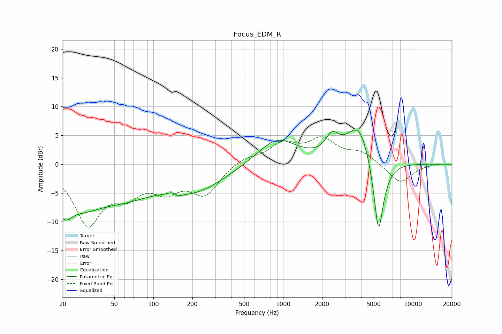

# Focus_EDM_R
See [usage instructions](https://github.com/jaakkopasanen/AutoEq#usage) for more options and info.

### Parametric EQs
Apply preamp of -6.0 dB when using parametric equalizer.

|   # | Type    |   Fc (Hz) |    Q |   Gain (dB) |
|-----|---------|-----------|------|-------------|
|   1 | Peaking |        20 | 2.12 |        -5.2 |
|   2 | Peaking |        29 | 0.92 |        -4.5 |
|   3 | Peaking |        59 | 0.63 |        -4.2 |
|   4 | Peaking |       146 | 4.03 |         4.6 |
|   5 | Peaking |       148 | 4.15 |        -4.6 |
|   6 | Peaking |       207 | 0.6  |        -4.3 |
|   7 | Peaking |       896 | 0.94 |         4.5 |
|   8 | Peaking |      2388 | 2.94 |         3   |
|   9 | Peaking |      3873 | 1.42 |         7.5 |
|  10 | Peaking |      5443 | 3.31 |       -14.6 |

### Fixed Band EQs
When using fixed band (also called graphic) equalizer, apply preamp of **-4.9 dB** (if available) and set gains manually with these parameters.

|   # | Type    |   Fc (Hz) |    Q |   Gain (dB) |
|-----|---------|-----------|------|-------------|
|   1 | Peaking |        31 | 1.41 |       -10   |
|   2 | Peaking |        62 | 1.41 |        -4   |
|   3 | Peaking |       125 | 1.41 |        -3.7 |
|   4 | Peaking |       250 | 1.41 |        -4.9 |
|   5 | Peaking |       500 | 1.41 |         1.2 |
|   6 | Peaking |      1000 | 1.41 |         3.3 |
|   7 | Peaking |      2000 | 1.41 |         3.9 |
|   8 | Peaking |      4000 | 1.41 |         1.9 |
|   9 | Peaking |      8000 | 1.41 |        -3.3 |
|  10 | Peaking |     16000 | 1.41 |         0.1 |

### Graphs

