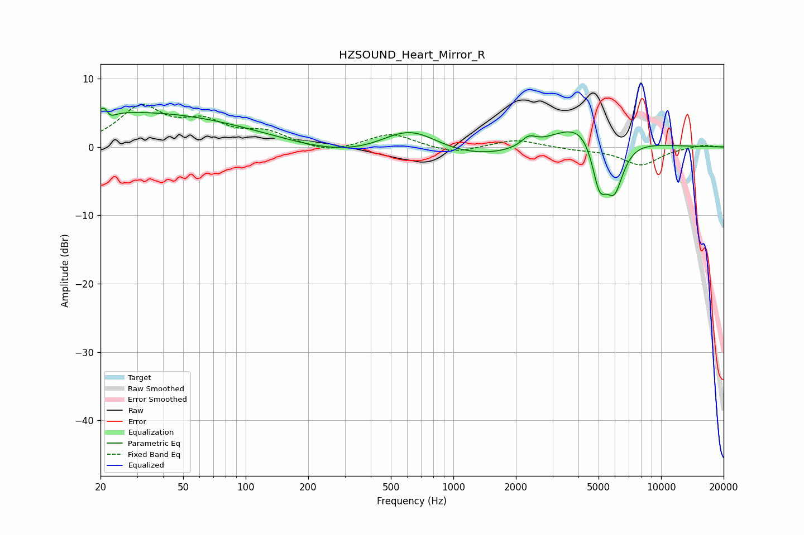

# HZSOUND_Heart_Mirror_R
See [usage instructions](https://github.com/jaakkopasanen/AutoEq#usage) for more options and info.

### Parametric EQs
Apply preamp of -5.7 dB when using parametric equalizer.

|   # | Type    |   Fc (Hz) |    Q |   Gain (dB) |
|-----|---------|-----------|------|-------------|
|   1 | Peaking |        20 | 0.33 |         4.3 |
|   2 | Peaking |        21 | 5.94 |         3   |
|   3 | Peaking |        22 | 5.64 |        -2.6 |
|   4 | Peaking |        82 | 0.4  |         2.2 |
|   5 | Peaking |       617 | 0.91 |         5.1 |
|   6 | Peaking |       655 | 0.28 |        -3.4 |
|   7 | Peaking |      2303 | 3.99 |         1.3 |
|   8 | Peaking |      4392 | 0.93 |         5.4 |
|   9 | Peaking |      5045 | 3.63 |        -7.5 |
|  10 | Peaking |      5959 | 2.91 |        -7.7 |

### Fixed Band EQs
When using fixed band (also called graphic) equalizer, apply preamp of **-6.3 dB** (if available) and set gains manually with these parameters.

|   # | Type    |   Fc (Hz) |    Q |   Gain (dB) |
|-----|---------|-----------|------|-------------|
|   1 | Peaking |        31 | 1.41 |         5.5 |
|   2 | Peaking |        62 | 1.41 |         3.1 |
|   3 | Peaking |       125 | 1.41 |         1.9 |
|   4 | Peaking |       250 | 1.41 |        -1   |
|   5 | Peaking |       500 | 1.41 |         2   |
|   6 | Peaking |      1000 | 1.41 |        -1   |
|   7 | Peaking |      2000 | 1.41 |         1.1 |
|   8 | Peaking |      4000 | 1.41 |        -0.3 |
|   9 | Peaking |      8000 | 1.41 |        -2.6 |
|  10 | Peaking |     16000 | 1.41 |         0.4 |

### Graphs

