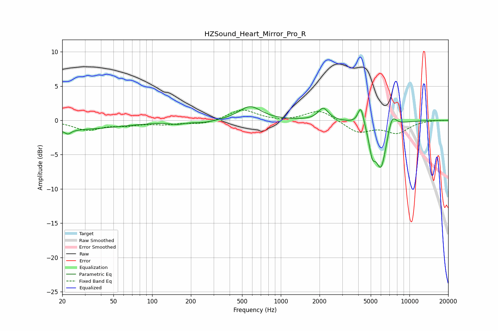

# HZSound_Heart_Mirror_Pro_R
See [usage instructions](https://github.com/jaakkopasanen/AutoEq#usage) for more options and info.

### Parametric EQs
Apply preamp of -2.1 dB when using parametric equalizer.

|   # | Type    |   Fc (Hz) |    Q |   Gain (dB) |
|-----|---------|-----------|------|-------------|
|   1 | Peaking |        20 | 0.31 |        -1.4 |
|   2 | Peaking |        22 | 5.74 |        -0.6 |
|   3 | Peaking |       156 | 2.58 |        -0.3 |
|   4 | Peaking |       253 | 1.56 |        -0.3 |
|   5 | Peaking |       577 | 1.65 |         2   |
|   6 | Peaking |      2137 | 3.61 |         1.8 |
|   7 | Peaking |      4189 | 5.98 |         2.8 |
|   8 | Peaking |      5133 | 5.77 |        -3.1 |
|   9 | Peaking |      6012 | 3.12 |        -6.8 |
|  10 | Peaking |      7306 | 4.01 |         2.3 |

### Fixed Band EQs
When using fixed band (also called graphic) equalizer, apply preamp of **-1.6 dB** (if available) and set gains manually with these parameters.

|   # | Type    |   Fc (Hz) |    Q |   Gain (dB) |
|-----|---------|-----------|------|-------------|
|   1 | Peaking |        31 | 1.41 |        -1.3 |
|   2 | Peaking |        62 | 1.41 |        -0.6 |
|   3 | Peaking |       125 | 1.41 |        -0.5 |
|   4 | Peaking |       250 | 1.41 |        -0.5 |
|   5 | Peaking |       500 | 1.41 |         1.6 |
|   6 | Peaking |      1000 | 1.41 |        -0.2 |
|   7 | Peaking |      2000 | 1.41 |         1.6 |
|   8 | Peaking |      4000 | 1.41 |        -1.7 |
|   9 | Peaking |      8000 | 1.41 |        -1.7 |
|  10 | Peaking |     16000 | 1.41 |         0.1 |

### Graphs

