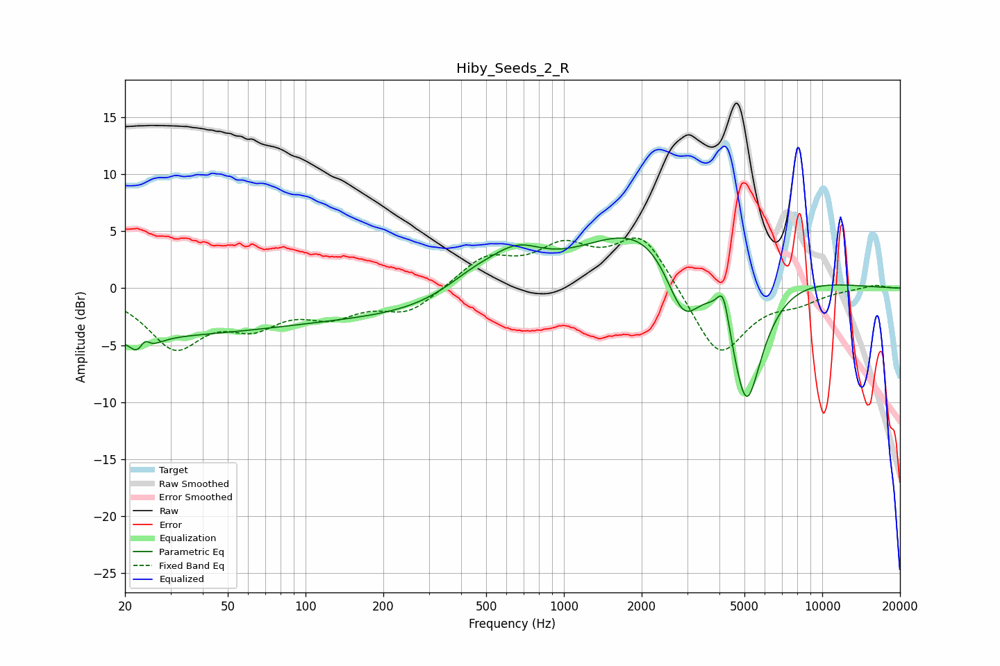

# Hiby_Seeds_2_R
See [usage instructions](https://github.com/jaakkopasanen/AutoEq#usage) for more options and info.

### Parametric EQs
Apply preamp of -4.5 dB when using parametric equalizer.

|   # | Type    |   Fc (Hz) |    Q |   Gain (dB) |
|-----|---------|-----------|------|-------------|
|   1 | Peaking |        20 | 0.19 |        -4   |
|   2 | Peaking |        23 | 4.05 |        -3.6 |
|   3 | Peaking |        24 | 5.98 |         2.9 |
|   4 | Peaking |       377 | 0.31 |        -2.4 |
|   5 | Peaking |       453 | 1.11 |         2.1 |
|   6 | Peaking |       659 | 1.35 |         2.8 |
|   7 | Peaking |      2598 | 0.45 |         8.1 |
|   8 | Peaking |      2900 | 1.85 |        -7.2 |
|   9 | Peaking |      4141 | 6    |         3.1 |
|  10 | Peaking |      5077 | 1.9  |       -14   |

### Fixed Band EQs
When using fixed band (also called graphic) equalizer, apply preamp of **-4.5 dB** (if available) and set gains manually with these parameters.

|   # | Type    |   Fc (Hz) |    Q |   Gain (dB) |
|-----|---------|-----------|------|-------------|
|   1 | Peaking |        31 | 1.41 |        -4.9 |
|   2 | Peaking |        62 | 1.41 |        -2.7 |
|   3 | Peaking |       125 | 1.41 |        -2   |
|   4 | Peaking |       250 | 1.41 |        -2.1 |
|   5 | Peaking |       500 | 1.41 |         2.6 |
|   6 | Peaking |      1000 | 1.41 |         3.2 |
|   7 | Peaking |      2000 | 1.41 |         4.8 |
|   8 | Peaking |      4000 | 1.41 |        -6.2 |
|   9 | Peaking |      8000 | 1.41 |        -1   |
|  10 | Peaking |     16000 | 1.41 |         0.3 |

### Graphs

