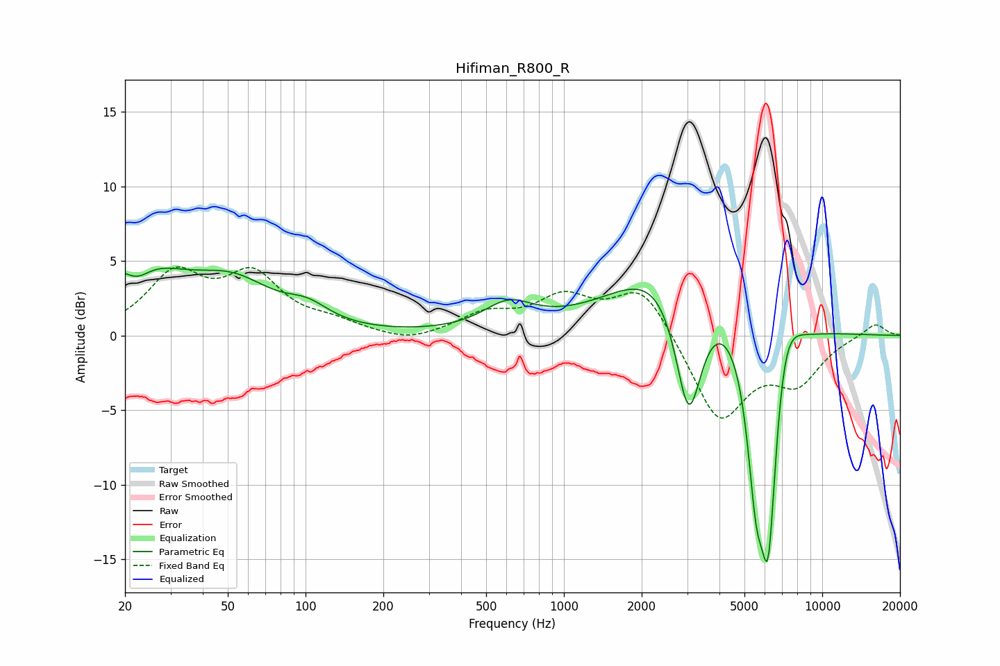

# Hifiman_R800_R
See [usage instructions](https://github.com/jaakkopasanen/AutoEq#usage) for more options and info.

### Parametric EQs
Apply preamp of -4.6 dB when using parametric equalizer.

|   # | Type    |   Fc (Hz) |    Q |   Gain (dB) |
|-----|---------|-----------|------|-------------|
|   1 | Peaking |        21 | 0.74 |         4.8 |
|   2 | Peaking |        22 | 2.6  |        -1.4 |
|   3 | Peaking |        53 | 0.92 |         2.7 |
|   4 | Peaking |       102 | 1.7  |         1.1 |
|   5 | Peaking |       610 | 1.45 |         1.8 |
|   6 | Peaking |      2889 | 0.68 |         7.1 |
|   7 | Peaking |      3041 | 2.37 |       -10.8 |
|   8 | Peaking |      5536 | 4.17 |        -7.4 |
|   9 | Peaking |      6188 | 3.34 |       -16.4 |
|  10 | Peaking |      7070 | 2.38 |         4.7 |

### Fixed Band EQs
When using fixed band (also called graphic) equalizer, apply preamp of **-4.7 dB** (if available) and set gains manually with these parameters.

|   # | Type    |   Fc (Hz) |    Q |   Gain (dB) |
|-----|---------|-----------|------|-------------|
|   1 | Peaking |        31 | 1.41 |         3.9 |
|   2 | Peaking |        62 | 1.41 |         3.7 |
|   3 | Peaking |       125 | 1.41 |         0.7 |
|   4 | Peaking |       250 | 1.41 |        -0.6 |
|   5 | Peaking |       500 | 1.41 |         1.3 |
|   6 | Peaking |      1000 | 1.41 |         2.3 |
|   7 | Peaking |      2000 | 1.41 |         3.4 |
|   8 | Peaking |      4000 | 1.41 |        -5.8 |
|   9 | Peaking |      8000 | 1.41 |        -2.8 |
|  10 | Peaking |     16000 | 1.41 |         0.9 |

### Graphs

