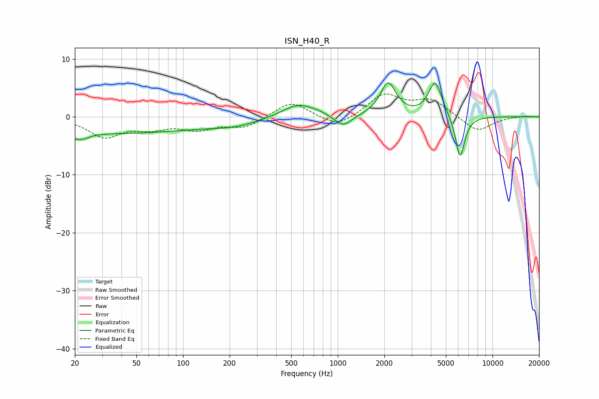

# ISN_H40_R
See [usage instructions](https://github.com/jaakkopasanen/AutoEq#usage) for more options and info.

### Parametric EQs
Apply preamp of -5.9 dB when using parametric equalizer.

|   # | Type    |   Fc (Hz) |    Q |   Gain (dB) |
|-----|---------|-----------|------|-------------|
|   1 | Peaking |        22 | 4.17 |        -2.9 |
|   2 | Peaking |        22 | 5.31 |         1.8 |
|   3 | Peaking |        31 | 0.18 |        -2.8 |
|   4 | Peaking |       220 | 1.02 |        -0.8 |
|   5 | Peaking |       539 | 1.45 |         1.9 |
|   6 | Peaking |       702 | 1.25 |         0.7 |
|   7 | Peaking |      1078 | 2.52 |        -2.2 |
|   8 | Peaking |      2115 | 2.79 |         5.7 |
|   9 | Peaking |      4265 | 3.2  |         6   |
|  10 | Peaking |      6171 | 4.47 |        -7.5 |

### Fixed Band EQs
When using fixed band (also called graphic) equalizer, apply preamp of **-4.0 dB** (if available) and set gains manually with these parameters.

|   # | Type    |   Fc (Hz) |    Q |   Gain (dB) |
|-----|---------|-----------|------|-------------|
|   1 | Peaking |        31 | 1.41 |        -3.3 |
|   2 | Peaking |        62 | 1.41 |        -1.6 |
|   3 | Peaking |       125 | 1.41 |        -1.9 |
|   4 | Peaking |       250 | 1.41 |        -1.8 |
|   5 | Peaking |       500 | 1.41 |         2.8 |
|   6 | Peaking |      1000 | 1.41 |        -2   |
|   7 | Peaking |      2000 | 1.41 |         3.8 |
|   8 | Peaking |      4000 | 1.41 |         2.8 |
|   9 | Peaking |      8000 | 1.41 |        -2.6 |
|  10 | Peaking |     16000 | 1.41 |         0.2 |

### Graphs

