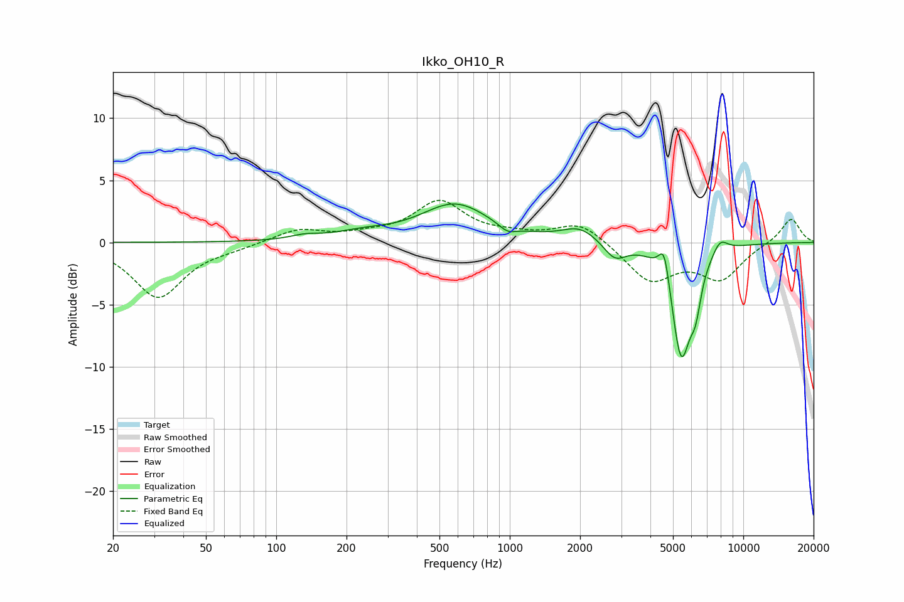

# Ikko_OH10_R
See [usage instructions](https://github.com/jaakkopasanen/AutoEq#usage) for more options and info.

### Parametric EQs
Apply preamp of -3.2 dB when using parametric equalizer.

|   # | Type    |   Fc (Hz) |    Q |   Gain (dB) |
|-----|---------|-----------|------|-------------|
|   1 | Peaking |       133 | 2.31 |         0.3 |
|   2 | Peaking |       235 | 1.12 |         0.6 |
|   3 | Peaking |       583 | 0.97 |         3   |
|   4 | Peaking |       977 | 3.84 |        -0.6 |
|   5 | Peaking |      2002 | 1.82 |         1.2 |
|   6 | Peaking |      2816 | 2.9  |        -1.4 |
|   7 | Peaking |      4589 | 6    |         2.8 |
|   8 | Peaking |      5422 | 3.19 |        -9.2 |
|   9 | Peaking |      6248 | 5.98 |        -2.5 |
|  10 | Peaking |      7943 | 4    |         1.2 |

### Fixed Band EQs
When using fixed band (also called graphic) equalizer, apply preamp of **-3.5 dB** (if available) and set gains manually with these parameters.

|   # | Type    |   Fc (Hz) |    Q |   Gain (dB) |
|-----|---------|-----------|------|-------------|
|   1 | Peaking |        31 | 1.41 |        -4.4 |
|   2 | Peaking |        62 | 1.41 |        -0.3 |
|   3 | Peaking |       125 | 1.41 |         1   |
|   4 | Peaking |       250 | 1.41 |         0.4 |
|   5 | Peaking |       500 | 1.41 |         3.2 |
|   6 | Peaking |      1000 | 1.41 |         0.4 |
|   7 | Peaking |      2000 | 1.41 |         1.7 |
|   8 | Peaking |      4000 | 1.41 |        -3.1 |
|   9 | Peaking |      8000 | 1.41 |        -2.8 |
|  10 | Peaking |     16000 | 1.41 |         2   |

### Graphs

