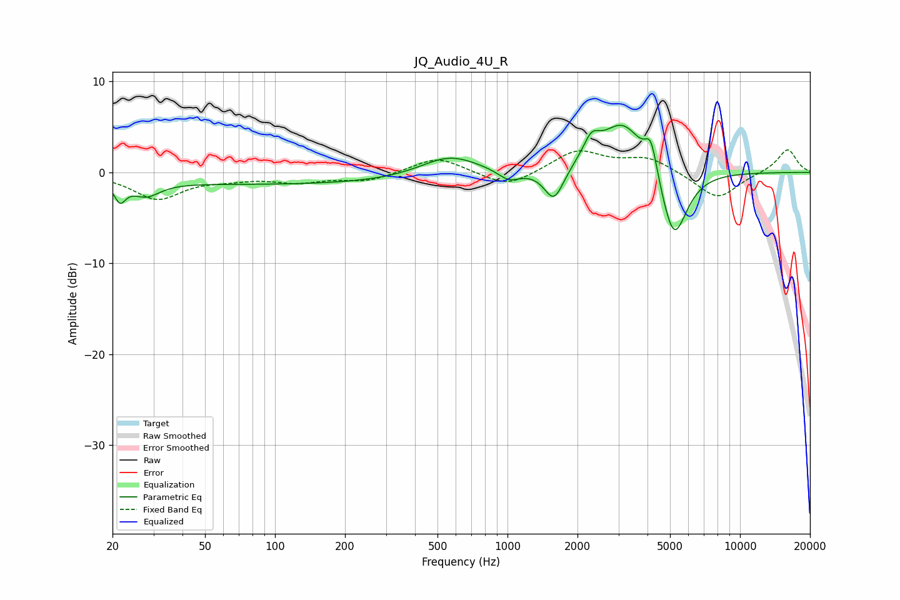

# JQ_Audio_4U_R
See [usage instructions](https://github.com/jaakkopasanen/AutoEq#usage) for more options and info.

### Parametric EQs
Apply preamp of -5.3 dB when using parametric equalizer.

|   # | Type    |   Fc (Hz) |    Q |   Gain (dB) |
|-----|---------|-----------|------|-------------|
|   1 | Peaking |        22 | 5.9  |        -2   |
|   2 | Peaking |        28 | 2.34 |        -1.6 |
|   3 | Peaking |       111 | 0.18 |        -1.3 |
|   4 | Peaking |       562 | 1.11 |         2.3 |
|   5 | Peaking |      1016 | 2.92 |        -1.2 |
|   6 | Peaking |      1584 | 3.32 |        -3.7 |
|   7 | Peaking |      2295 | 3.98 |         2.2 |
|   8 | Peaking |      3139 | 1.48 |         5.8 |
|   9 | Peaking |      4143 | 5.41 |         3.5 |
|  10 | Peaking |      5190 | 2.41 |        -8.3 |

### Fixed Band EQs
When using fixed band (also called graphic) equalizer, apply preamp of **-2.6 dB** (if available) and set gains manually with these parameters.

|   # | Type    |   Fc (Hz) |    Q |   Gain (dB) |
|-----|---------|-----------|------|-------------|
|   1 | Peaking |        31 | 1.41 |        -2.8 |
|   2 | Peaking |        62 | 1.41 |        -0.5 |
|   3 | Peaking |       125 | 1.41 |        -0.9 |
|   4 | Peaking |       250 | 1.41 |        -0.9 |
|   5 | Peaking |       500 | 1.41 |         1.8 |
|   6 | Peaking |      1000 | 1.41 |        -1.7 |
|   7 | Peaking |      2000 | 1.41 |         2.4 |
|   8 | Peaking |      4000 | 1.41 |         1.6 |
|   9 | Peaking |      8000 | 1.41 |        -3   |
|  10 | Peaking |     16000 | 1.41 |         2.6 |

### Graphs

