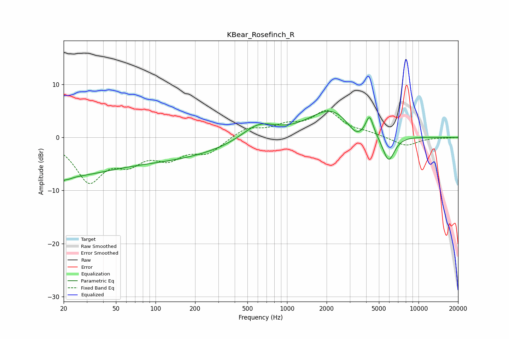

# KBear_Rosefinch_R
See [usage instructions](https://github.com/jaakkopasanen/AutoEq#usage) for more options and info.

### Parametric EQs
Apply preamp of -5.0 dB when using parametric equalizer.

|   # | Type    |   Fc (Hz) |    Q |   Gain (dB) |
|-----|---------|-----------|------|-------------|
|   1 | Peaking |        20 | 4.25 |        -5.2 |
|   2 | Peaking |        20 | 5.22 |         3.6 |
|   3 | Peaking |        21 | 0.54 |        -4.3 |
|   4 | Peaking |        85 | 0.23 |        -4.3 |
|   5 | Peaking |       590 | 1.11 |         2.1 |
|   6 | Peaking |       641 | 1.27 |         0.9 |
|   7 | Peaking |      2194 | 0.82 |         5.4 |
|   8 | Peaking |      3356 | 2.05 |        -2.5 |
|   9 | Peaking |      4240 | 4.87 |         3.7 |
|  10 | Peaking |      5920 | 2.94 |        -5.1 |

### Fixed Band EQs
When using fixed band (also called graphic) equalizer, apply preamp of **-5.2 dB** (if available) and set gains manually with these parameters.

|   # | Type    |   Fc (Hz) |    Q |   Gain (dB) |
|-----|---------|-----------|------|-------------|
|   1 | Peaking |        31 | 1.41 |        -7.8 |
|   2 | Peaking |        62 | 1.41 |        -3.8 |
|   3 | Peaking |       125 | 1.41 |        -3.3 |
|   4 | Peaking |       250 | 1.41 |        -2.7 |
|   5 | Peaking |       500 | 1.41 |         1.8 |
|   6 | Peaking |      1000 | 1.41 |         1.8 |
|   7 | Peaking |      2000 | 1.41 |         4.7 |
|   8 | Peaking |      4000 | 1.41 |         0.6 |
|   9 | Peaking |      8000 | 1.41 |        -1.6 |
|  10 | Peaking |     16000 | 1.41 |        -0.1 |

### Graphs

