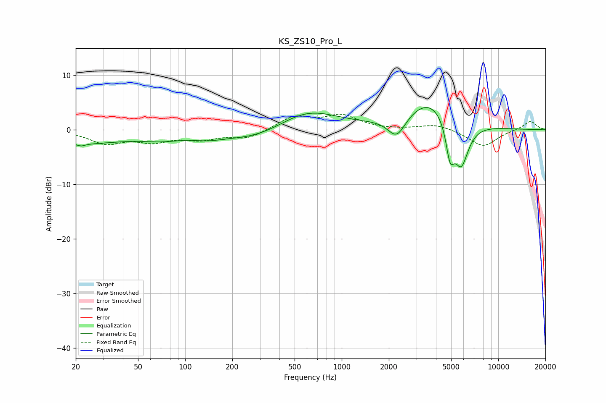

# KS_ZS10_Pro_L
See [usage instructions](https://github.com/jaakkopasanen/AutoEq#usage) for more options and info.

### Parametric EQs
Apply preamp of -4.2 dB when using parametric equalizer.

|   # | Type    |   Fc (Hz) |    Q |   Gain (dB) |
|-----|---------|-----------|------|-------------|
|   1 | Peaking |        21 | 0.47 |        -2.4 |
|   2 | Peaking |        22 | 5.62 |        -0.4 |
|   3 | Peaking |        71 | 1.11 |        -1   |
|   4 | Peaking |       138 | 1.35 |        -0.8 |
|   5 | Peaking |       290 | 0.63 |        -2.2 |
|   6 | Peaking |       596 | 0.73 |         4   |
|   7 | Peaking |      2246 | 2.46 |        -4   |
|   8 | Peaking |      3715 | 0.87 |         5.9 |
|   9 | Peaking |      4921 | 5.15 |        -6.2 |
|  10 | Peaking |      5788 | 2.76 |        -8.6 |

### Fixed Band EQs
When using fixed band (also called graphic) equalizer, apply preamp of **-3.0 dB** (if available) and set gains manually with these parameters.

|   # | Type    |   Fc (Hz) |    Q |   Gain (dB) |
|-----|---------|-----------|------|-------------|
|   1 | Peaking |        31 | 1.41 |        -2.3 |
|   2 | Peaking |        62 | 1.41 |        -1.8 |
|   3 | Peaking |       125 | 1.41 |        -1.5 |
|   4 | Peaking |       250 | 1.41 |        -1.6 |
|   5 | Peaking |       500 | 1.41 |         2.4 |
|   6 | Peaking |      1000 | 1.41 |         2.5 |
|   7 | Peaking |      2000 | 1.41 |        -0   |
|   8 | Peaking |      4000 | 1.41 |         1   |
|   9 | Peaking |      8000 | 1.41 |        -3.1 |
|  10 | Peaking |     16000 | 1.41 |         1.7 |

### Graphs

