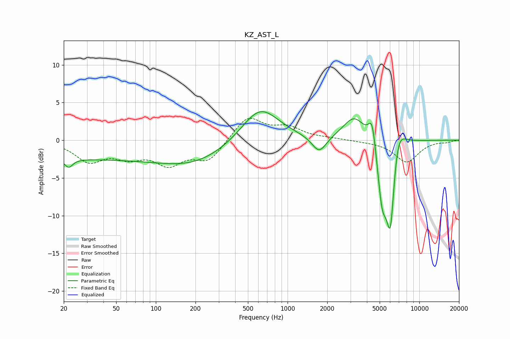

# KZ_AST_L
See [usage instructions](https://github.com/jaakkopasanen/AutoEq#usage) for more options and info.

### Parametric EQs
Apply preamp of -3.9 dB when using parametric equalizer.

|   # | Type    |   Fc (Hz) |    Q |   Gain (dB) |
|-----|---------|-----------|------|-------------|
|   1 | Peaking |        22 | 4.81 |        -1.1 |
|   2 | Peaking |        24 | 0.18 |        -2.4 |
|   3 | Peaking |       203 | 0.52 |        -2.6 |
|   4 | Peaking |       617 | 0.99 |         4.7 |
|   5 | Peaking |      1737 | 2.59 |        -2.3 |
|   6 | Peaking |      3215 | 1.66 |         3.3 |
|   7 | Peaking |      4391 | 4.8  |         4   |
|   8 | Peaking |      5224 | 3.62 |        -7.6 |
|   9 | Peaking |      6036 | 4.09 |       -11.8 |
|  10 | Peaking |      6809 | 2.66 |         4.2 |

### Fixed Band EQs
When using fixed band (also called graphic) equalizer, apply preamp of **-3.0 dB** (if available) and set gains manually with these parameters.

|   # | Type    |   Fc (Hz) |    Q |   Gain (dB) |
|-----|---------|-----------|------|-------------|
|   1 | Peaking |        31 | 1.41 |        -2.6 |
|   2 | Peaking |        62 | 1.41 |        -1.8 |
|   3 | Peaking |       125 | 1.41 |        -2.8 |
|   4 | Peaking |       250 | 1.41 |        -2.6 |
|   5 | Peaking |       500 | 1.41 |         3.2 |
|   6 | Peaking |      1000 | 1.41 |         1.5 |
|   7 | Peaking |      2000 | 1.41 |         0.2 |
|   8 | Peaking |      4000 | 1.41 |        -0.1 |
|   9 | Peaking |      8000 | 1.41 |        -2.9 |
|  10 | Peaking |     16000 | 1.41 |        -0.2 |

### Graphs

