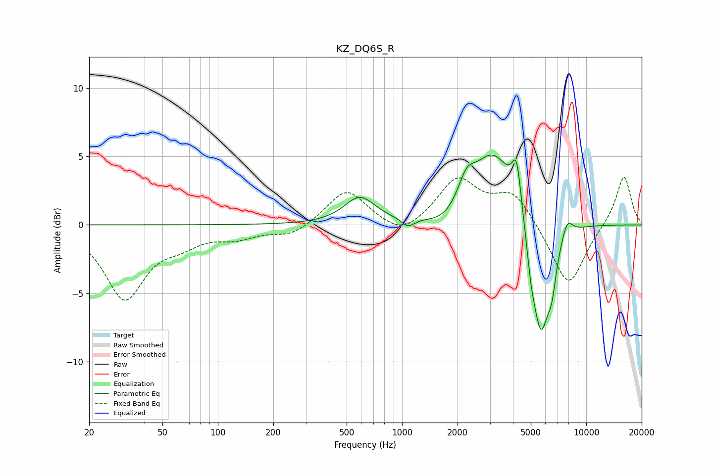

# KZ_DQ6S_R
See [usage instructions](https://github.com/jaakkopasanen/AutoEq#usage) for more options and info.

### Parametric EQs
Apply preamp of -5.2 dB when using parametric equalizer.

|   # | Type    |   Fc (Hz) |    Q |   Gain (dB) |
|-----|---------|-----------|------|-------------|
|   1 | Peaking |       589 | 1.7  |         1.9 |
|   2 | Peaking |      1076 | 4.14 |        -0.6 |
|   3 | Peaking |      1718 | 1.46 |        -1   |
|   4 | Peaking |      2235 | 3.14 |         1.7 |
|   5 | Peaking |      3142 | 1.17 |         5.5 |
|   6 | Peaking |      4192 | 5.5  |         3.4 |
|   7 | Peaking |      5005 | 6    |        -1.5 |
|   8 | Peaking |      5664 | 2.7  |        -8.7 |
|   9 | Peaking |      6510 | 6    |        -2   |
|  10 | Peaking |      7885 | 4.62 |         1.3 |

### Fixed Band EQs
When using fixed band (also called graphic) equalizer, apply preamp of **-3.6 dB** (if available) and set gains manually with these parameters.

|   # | Type    |   Fc (Hz) |    Q |   Gain (dB) |
|-----|---------|-----------|------|-------------|
|   1 | Peaking |        31 | 1.41 |        -5.3 |
|   2 | Peaking |        62 | 1.41 |        -1   |
|   3 | Peaking |       125 | 1.41 |        -0.8 |
|   4 | Peaking |       250 | 1.41 |        -0.8 |
|   5 | Peaking |       500 | 1.41 |         2.6 |
|   6 | Peaking |      1000 | 1.41 |        -1.1 |
|   7 | Peaking |      2000 | 1.41 |         3.3 |
|   8 | Peaking |      4000 | 1.41 |         2.3 |
|   9 | Peaking |      8000 | 1.41 |        -4.6 |
|  10 | Peaking |     16000 | 1.41 |         3.7 |

### Graphs

