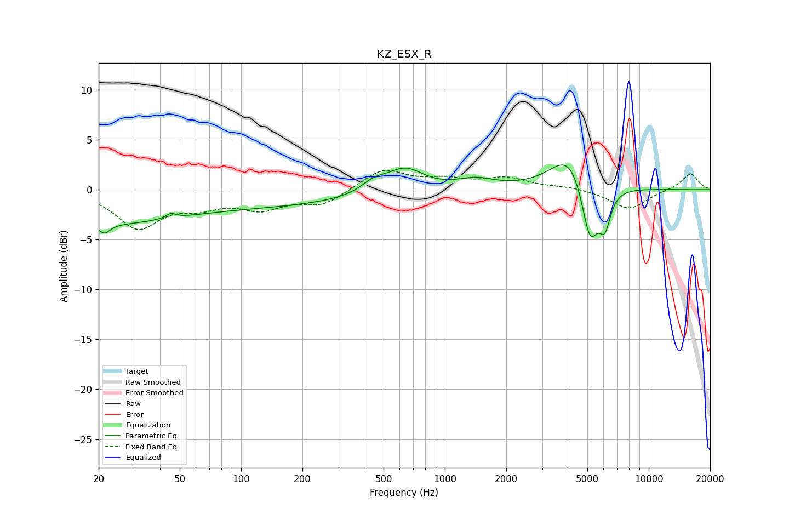

# KZ_ESX_R
See [usage instructions](https://github.com/jaakkopasanen/AutoEq#usage) for more options and info.

### Parametric EQs
Apply preamp of -2.6 dB when using parametric equalizer.

|   # | Type    |   Fc (Hz) |    Q |   Gain (dB) |
|-----|---------|-----------|------|-------------|
|   1 | Peaking |        20 | 0.46 |        -2.7 |
|   2 | Peaking |        21 | 4.94 |        -1   |
|   3 | Peaking |        45 | 5.89 |         0.5 |
|   4 | Peaking |       109 | 0.24 |        -1.6 |
|   5 | Peaking |       446 | 2.32 |         1   |
|   6 | Peaking |       636 | 1.54 |         2.3 |
|   7 | Peaking |      1419 | 1.53 |         0.9 |
|   8 | Peaking |      4119 | 1.5  |         3.9 |
|   9 | Peaking |      5143 | 3.28 |        -6.4 |
|  10 | Peaking |      6093 | 4.85 |        -3.3 |

### Fixed Band EQs
When using fixed band (also called graphic) equalizer, apply preamp of **-2.0 dB** (if available) and set gains manually with these parameters.

|   # | Type    |   Fc (Hz) |    Q |   Gain (dB) |
|-----|---------|-----------|------|-------------|
|   1 | Peaking |        31 | 1.41 |        -3.7 |
|   2 | Peaking |        62 | 1.41 |        -1.3 |
|   3 | Peaking |       125 | 1.41 |        -1.7 |
|   4 | Peaking |       250 | 1.41 |        -1.5 |
|   5 | Peaking |       500 | 1.41 |         2.1 |
|   6 | Peaking |      1000 | 1.41 |         0.8 |
|   7 | Peaking |      2000 | 1.41 |         1.1 |
|   8 | Peaking |      4000 | 1.41 |         0.3 |
|   9 | Peaking |      8000 | 1.41 |        -2   |
|  10 | Peaking |     16000 | 1.41 |         1.6 |

### Graphs

