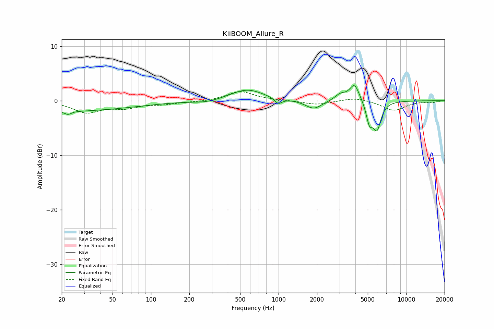

# KiiBOOM_Allure_R
See [usage instructions](https://github.com/jaakkopasanen/AutoEq#usage) for more options and info.

### Parametric EQs
Apply preamp of -2.9 dB when using parametric equalizer.

|   # | Type    |   Fc (Hz) |    Q |   Gain (dB) |
|-----|---------|-----------|------|-------------|
|   1 | Peaking |        20 | 0.24 |        -1.9 |
|   2 | Peaking |        22 | 5.59 |        -0.6 |
|   3 | Peaking |       274 | 1.46 |        -0.5 |
|   4 | Peaking |       567 | 1.1  |         2.1 |
|   5 | Peaking |       995 | 4.94 |        -1.1 |
|   6 | Peaking |      1886 | 2.18 |        -1.6 |
|   7 | Peaking |      3053 | 3.13 |         1.2 |
|   8 | Peaking |      3940 | 3.68 |         3.1 |
|   9 | Peaking |      5149 | 5.57 |        -3.4 |
|  10 | Peaking |      5900 | 4.27 |        -4.9 |

### Fixed Band EQs
When using fixed band (also called graphic) equalizer, apply preamp of **-1.7 dB** (if available) and set gains manually with these parameters.

|   # | Type    |   Fc (Hz) |    Q |   Gain (dB) |
|-----|---------|-----------|------|-------------|
|   1 | Peaking |        31 | 1.41 |        -2.1 |
|   2 | Peaking |        62 | 1.41 |        -1.1 |
|   3 | Peaking |       125 | 1.41 |        -0.5 |
|   4 | Peaking |       250 | 1.41 |        -0.2 |
|   5 | Peaking |       500 | 1.41 |         1.7 |
|   6 | Peaking |      1000 | 1.41 |         0   |
|   7 | Peaking |      2000 | 1.41 |        -0.7 |
|   8 | Peaking |      4000 | 1.41 |         0.6 |
|   9 | Peaking |      8000 | 1.41 |        -1.8 |
|  10 | Peaking |     16000 | 1.41 |        -0.3 |

### Graphs

