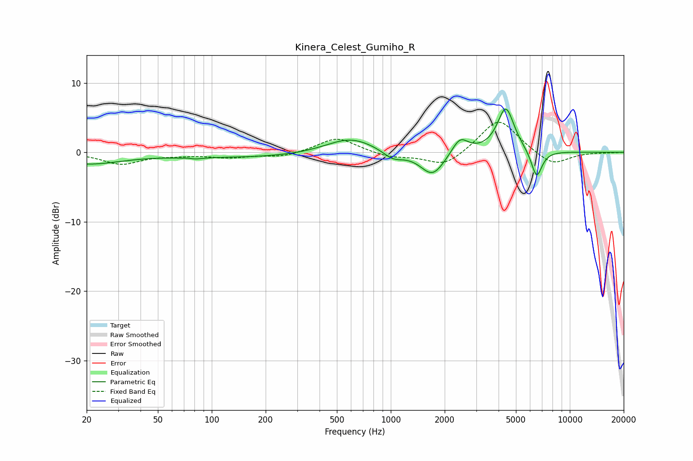

# Kinera_Celest_Gumiho_R
See [usage instructions](https://github.com/jaakkopasanen/AutoEq#usage) for more options and info.

### Parametric EQs
Apply preamp of -6.3 dB when using parametric equalizer.

|   # | Type    |   Fc (Hz) |    Q |   Gain (dB) |
|-----|---------|-----------|------|-------------|
|   1 | Peaking |        20 | 0.72 |        -1.6 |
|   2 | Peaking |        75 | 4.33 |         0.7 |
|   3 | Peaking |        76 | 3.57 |        -0.9 |
|   4 | Peaking |       175 | 0.33 |        -0.7 |
|   5 | Peaking |       594 | 1.02 |         2.3 |
|   6 | Peaking |      1030 | 2.49 |        -1.2 |
|   7 | Peaking |      1712 | 2.08 |        -3.5 |
|   8 | Peaking |      2434 | 3.13 |         2.3 |
|   9 | Peaking |      4391 | 2.97 |         6.5 |
|  10 | Peaking |      6528 | 4.48 |        -4   |

### Fixed Band EQs
When using fixed band (also called graphic) equalizer, apply preamp of **-4.4 dB** (if available) and set gains manually with these parameters.

|   # | Type    |   Fc (Hz) |    Q |   Gain (dB) |
|-----|---------|-----------|------|-------------|
|   1 | Peaking |        31 | 1.41 |        -1.6 |
|   2 | Peaking |        62 | 1.41 |        -0.3 |
|   3 | Peaking |       125 | 1.41 |        -0.7 |
|   4 | Peaking |       250 | 1.41 |        -0.7 |
|   5 | Peaking |       500 | 1.41 |         2.2 |
|   6 | Peaking |      1000 | 1.41 |        -0.7 |
|   7 | Peaking |      2000 | 1.41 |        -2.1 |
|   8 | Peaking |      4000 | 1.41 |         5   |
|   9 | Peaking |      8000 | 1.41 |        -2   |
|  10 | Peaking |     16000 | 1.41 |        -0   |

### Graphs

