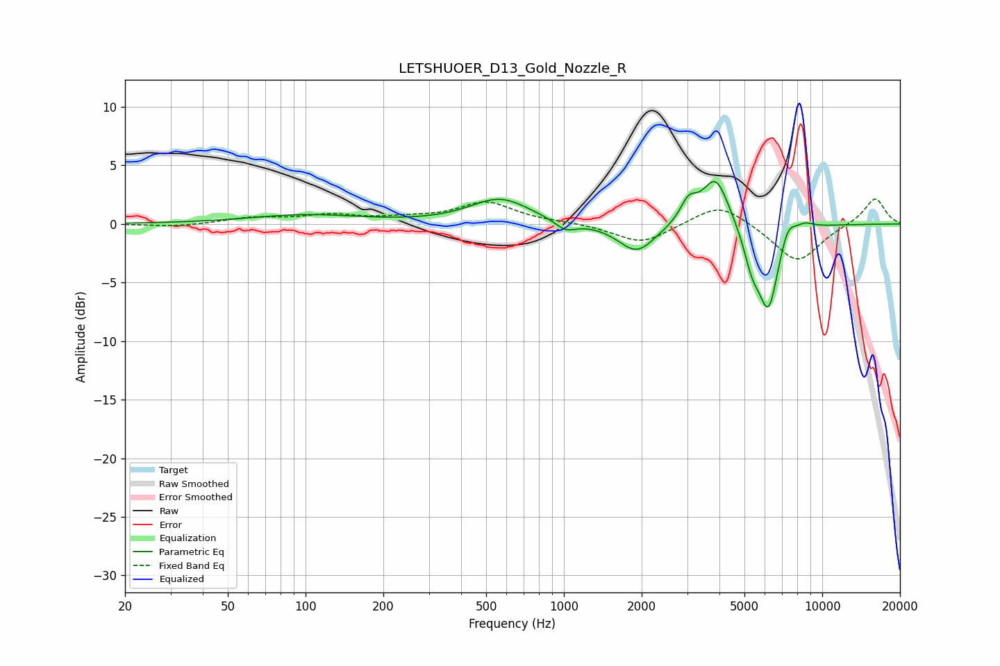

# LETSHUOER_D13_Gold_Nozzle_R
See [usage instructions](https://github.com/jaakkopasanen/AutoEq#usage) for more options and info.

### Parametric EQs
Apply preamp of -3.7 dB when using parametric equalizer.

|   # | Type    |   Fc (Hz) |    Q |   Gain (dB) |
|-----|---------|-----------|------|-------------|
|   1 | Peaking |       100 | 0.65 |         0.8 |
|   2 | Peaking |       566 | 1.22 |         2.1 |
|   3 | Peaking |      1014 | 3.38 |        -0.9 |
|   4 | Peaking |      1915 | 1.96 |        -2.5 |
|   5 | Peaking |      3040 | 4.3  |         1.8 |
|   6 | Peaking |      3873 | 2.71 |         4.2 |
|   7 | Peaking |      5350 | 4.27 |        -2.6 |
|   8 | Peaking |      6193 | 3.43 |        -7   |
|   9 | Peaking |      7351 | 4.64 |         1.5 |
|  10 | Peaking |      8544 | 3.57 |         0.6 |

### Fixed Band EQs
When using fixed band (also called graphic) equalizer, apply preamp of **-2.2 dB** (if available) and set gains manually with these parameters.

|   # | Type    |   Fc (Hz) |    Q |   Gain (dB) |
|-----|---------|-----------|------|-------------|
|   1 | Peaking |        31 | 1.41 |        -0.2 |
|   2 | Peaking |        62 | 1.41 |         0.5 |
|   3 | Peaking |       125 | 1.41 |         0.7 |
|   4 | Peaking |       250 | 1.41 |         0.4 |
|   5 | Peaking |       500 | 1.41 |         1.8 |
|   6 | Peaking |      1000 | 1.41 |         0.1 |
|   7 | Peaking |      2000 | 1.41 |        -1.7 |
|   8 | Peaking |      4000 | 1.41 |         1.9 |
|   9 | Peaking |      8000 | 1.41 |        -3.3 |
|  10 | Peaking |     16000 | 1.41 |         2.3 |

### Graphs

