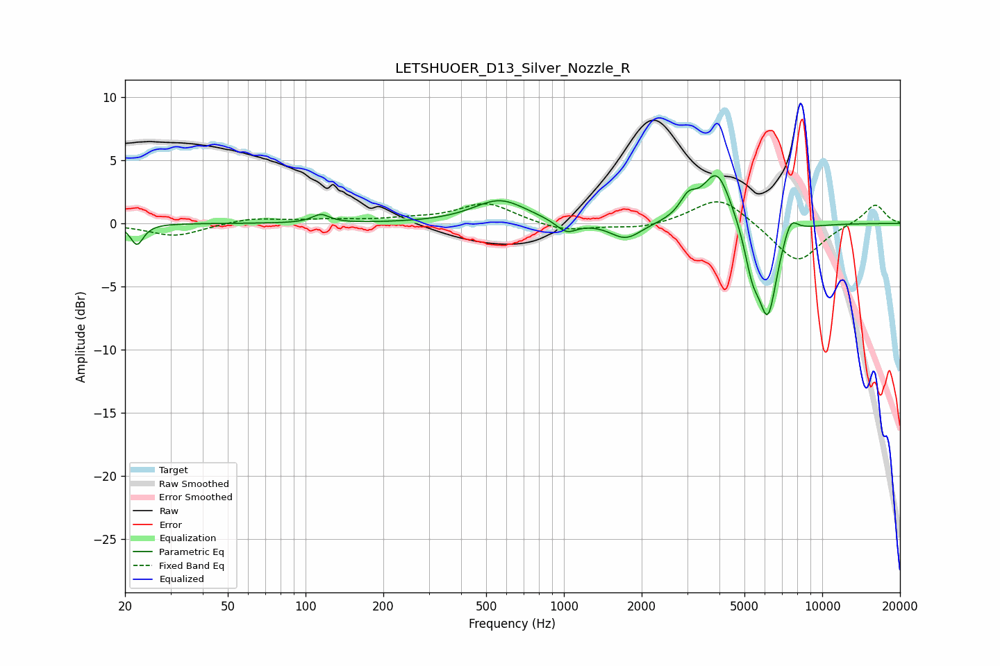

# LETSHUOER_D13_Silver_Nozzle_R
See [usage instructions](https://github.com/jaakkopasanen/AutoEq#usage) for more options and info.

### Parametric EQs
Apply preamp of -3.9 dB when using parametric equalizer.

|   # | Type    |   Fc (Hz) |    Q |   Gain (dB) |
|-----|---------|-----------|------|-------------|
|   1 | Peaking |        22 | 5.83 |        -1.7 |
|   2 | Peaking |       115 | 4.24 |         0.7 |
|   3 | Peaking |       566 | 1.37 |         1.9 |
|   4 | Peaking |      1024 | 3.5  |        -1   |
|   5 | Peaking |      1738 | 2.32 |        -1.4 |
|   6 | Peaking |      3028 | 4.41 |         1.4 |
|   7 | Peaking |      3916 | 2.51 |         4.3 |
|   8 | Peaking |      5359 | 4.57 |        -2.9 |
|   9 | Peaking |      6161 | 3.71 |        -7.1 |
|  10 | Peaking |      7537 | 4.72 |         1.6 |

### Fixed Band EQs
When using fixed band (also called graphic) equalizer, apply preamp of **-1.8 dB** (if available) and set gains manually with these parameters.

|   # | Type    |   Fc (Hz) |    Q |   Gain (dB) |
|-----|---------|-----------|------|-------------|
|   1 | Peaking |        31 | 1.41 |        -1   |
|   2 | Peaking |        62 | 1.41 |         0.4 |
|   3 | Peaking |       125 | 1.41 |         0.2 |
|   4 | Peaking |       250 | 1.41 |         0.3 |
|   5 | Peaking |       500 | 1.41 |         1.6 |
|   6 | Peaking |      1000 | 1.41 |        -0.7 |
|   7 | Peaking |      2000 | 1.41 |        -0.4 |
|   8 | Peaking |      4000 | 1.41 |         2.2 |
|   9 | Peaking |      8000 | 1.41 |        -3.2 |
|  10 | Peaking |     16000 | 1.41 |         1.6 |

### Graphs

