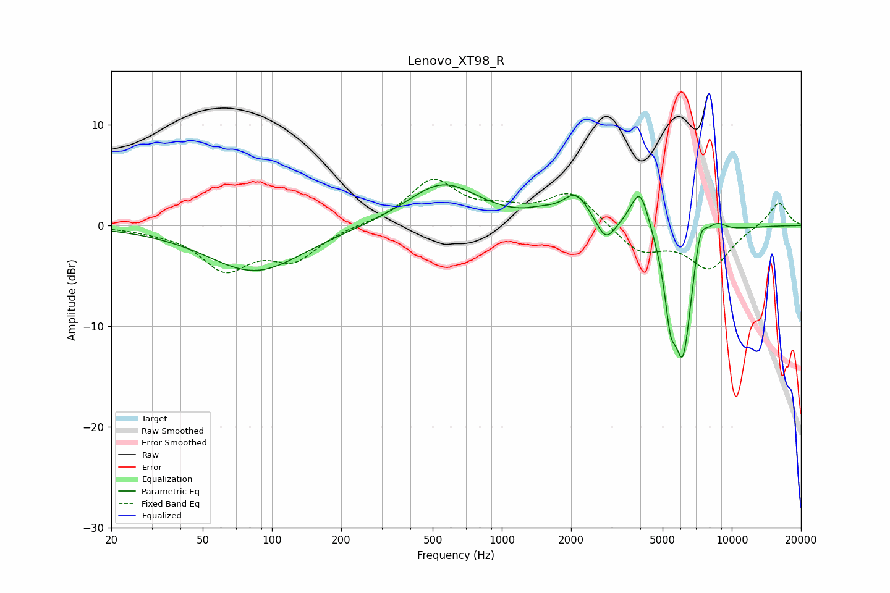

# Lenovo_XT98_R
See [usage instructions](https://github.com/jaakkopasanen/AutoEq#usage) for more options and info.

### Parametric EQs
Apply preamp of -4.1 dB when using parametric equalizer.

|   # | Type    |   Fc (Hz) |    Q |   Gain (dB) |
|-----|---------|-----------|------|-------------|
|   1 | Peaking |        85 | 0.68 |        -4.6 |
|   2 | Peaking |       553 | 0.9  |         4.2 |
|   3 | Peaking |      1483 | 2.25 |         0.6 |
|   4 | Peaking |      2102 | 2.37 |         2.9 |
|   5 | Peaking |      2827 | 3.5  |        -2.2 |
|   6 | Peaking |      3990 | 3.3  |         4.7 |
|   7 | Peaking |      5405 | 5.97 |        -4.8 |
|   8 | Peaking |      6131 | 3.07 |       -13.3 |
|   9 | Peaking |      7280 | 4.53 |         3.7 |
|  10 | Peaking |      8502 | 2.78 |         1.5 |

### Fixed Band EQs
When using fixed band (also called graphic) equalizer, apply preamp of **-4.7 dB** (if available) and set gains manually with these parameters.

|   # | Type    |   Fc (Hz) |    Q |   Gain (dB) |
|-----|---------|-----------|------|-------------|
|   1 | Peaking |        31 | 1.41 |        -0.3 |
|   2 | Peaking |        62 | 1.41 |        -4.1 |
|   3 | Peaking |       125 | 1.41 |        -3.1 |
|   4 | Peaking |       250 | 1.41 |         0   |
|   5 | Peaking |       500 | 1.41 |         4.4 |
|   6 | Peaking |      1000 | 1.41 |         1.2 |
|   7 | Peaking |      2000 | 1.41 |         3.3 |
|   8 | Peaking |      4000 | 1.41 |        -2.6 |
|   9 | Peaking |      8000 | 1.41 |        -4.2 |
|  10 | Peaking |     16000 | 1.41 |         2.4 |

### Graphs

