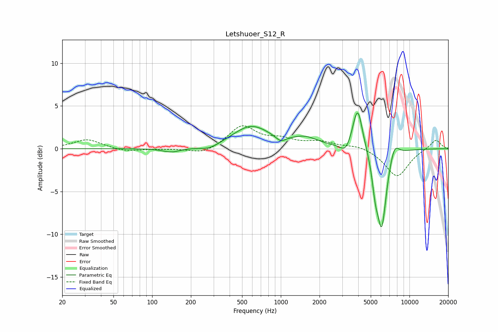

# Letshuoer_S12_R
See [usage instructions](https://github.com/jaakkopasanen/AutoEq#usage) for more options and info.

### Parametric EQs
Apply preamp of -4.3 dB when using parametric equalizer.

|   # | Type    |   Fc (Hz) |    Q |   Gain (dB) |
|-----|---------|-----------|------|-------------|
|   1 | Peaking |       141 | 2.01 |        -0.5 |
|   2 | Peaking |       279 | 1.82 |        -0.5 |
|   3 | Peaking |       588 | 0.98 |         2.6 |
|   4 | Peaking |       998 | 3.76 |        -0.6 |
|   5 | Peaking |      1539 | 1.34 |         1.1 |
|   6 | Peaking |      3183 | 3.72 |        -1.1 |
|   7 | Peaking |      3956 | 3.69 |         5.1 |
|   8 | Peaking |      5418 | 6    |        -2.6 |
|   9 | Peaking |      6080 | 3.7  |        -9.1 |
|  10 | Peaking |      7641 | 3.83 |         1.7 |

### Fixed Band EQs
When using fixed band (also called graphic) equalizer, apply preamp of **-2.8 dB** (if available) and set gains manually with these parameters.

|   # | Type    |   Fc (Hz) |    Q |   Gain (dB) |
|-----|---------|-----------|------|-------------|
|   1 | Peaking |        31 | 1.41 |         1.1 |
|   2 | Peaking |        62 | 1.41 |        -0.4 |
|   3 | Peaking |       125 | 1.41 |        -0   |
|   4 | Peaking |       250 | 1.41 |        -0.7 |
|   5 | Peaking |       500 | 1.41 |         2.6 |
|   6 | Peaking |      1000 | 1.41 |         0.9 |
|   7 | Peaking |      2000 | 1.41 |         0.7 |
|   8 | Peaking |      4000 | 1.41 |         0.4 |
|   9 | Peaking |      8000 | 1.41 |        -3.3 |
|  10 | Peaking |     16000 | 1.41 |         1.1 |

### Graphs

