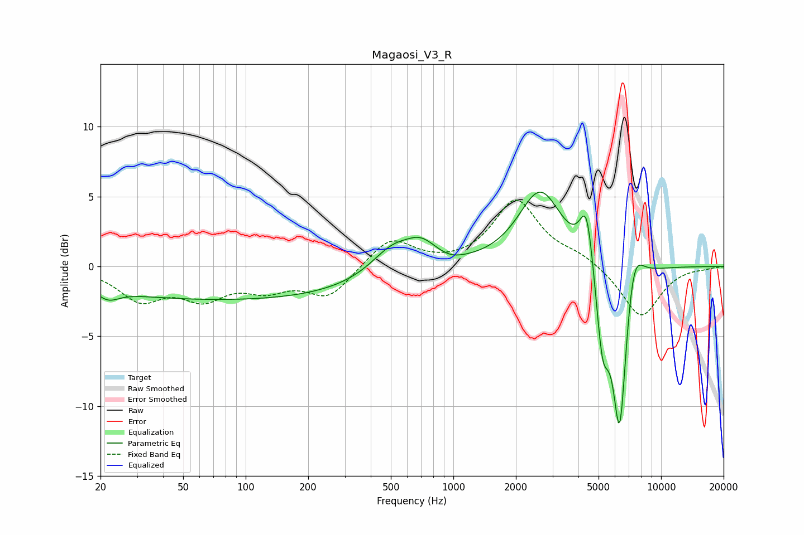

# Magaosi_V3_R
See [usage instructions](https://github.com/jaakkopasanen/AutoEq#usage) for more options and info.

### Parametric EQs
Apply preamp of -5.4 dB when using parametric equalizer.

|   # | Type    |   Fc (Hz) |    Q |   Gain (dB) |
|-----|---------|-----------|------|-------------|
|   1 | Peaking |        22 | 2.78 |        -0.7 |
|   2 | Peaking |        84 | 0.18 |        -2.4 |
|   3 | Peaking |       512 | 1.33 |         2   |
|   4 | Peaking |       703 | 1.94 |         1.4 |
|   5 | Peaking |       980 | 2.76 |        -0.2 |
|   6 | Peaking |      2623 | 1.34 |         5.4 |
|   7 | Peaking |      4386 | 4.17 |         4.3 |
|   8 | Peaking |      5223 | 4.35 |        -5.6 |
|   9 | Peaking |      6325 | 3.77 |       -12.6 |
|  10 | Peaking |      7340 | 3.06 |         3.7 |

### Fixed Band EQs
When using fixed band (also called graphic) equalizer, apply preamp of **-4.8 dB** (if available) and set gains manually with these parameters.

|   # | Type    |   Fc (Hz) |    Q |   Gain (dB) |
|-----|---------|-----------|------|-------------|
|   1 | Peaking |        31 | 1.41 |        -2.2 |
|   2 | Peaking |        62 | 1.41 |        -2   |
|   3 | Peaking |       125 | 1.41 |        -1.3 |
|   4 | Peaking |       250 | 1.41 |        -2.1 |
|   5 | Peaking |       500 | 1.41 |         2.1 |
|   6 | Peaking |      1000 | 1.41 |        -0   |
|   7 | Peaking |      2000 | 1.41 |         4.7 |
|   8 | Peaking |      4000 | 1.41 |         0.7 |
|   9 | Peaking |      8000 | 1.41 |        -3.7 |
|  10 | Peaking |     16000 | 1.41 |        -0.1 |

### Graphs

