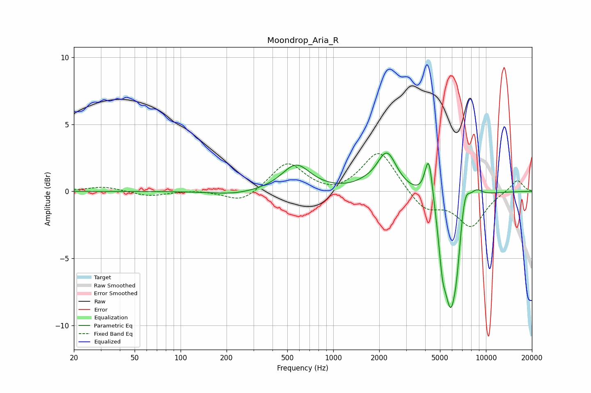

# Moondrop_Aria_R
See [usage instructions](https://github.com/jaakkopasanen/AutoEq#usage) for more options and info.

### Parametric EQs
Apply preamp of -3.0 dB when using parametric equalizer.

|   # | Type    |   Fc (Hz) |    Q |   Gain (dB) |
|-----|---------|-----------|------|-------------|
|   1 | Peaking |       224 | 0.99 |        -0.3 |
|   2 | Peaking |       571 | 1.52 |         2   |
|   3 | Peaking |      1605 | 2.06 |         0.2 |
|   4 | Peaking |      2243 | 2.21 |         2.8 |
|   5 | Peaking |      4225 | 5.38 |         3.5 |
|   6 | Peaking |      5182 | 6    |        -2.6 |
|   7 | Peaking |      5878 | 3.02 |        -8.1 |
|   8 | Peaking |      6441 | 6    |        -1.6 |
|   9 | Peaking |      7287 | 4.49 |         2   |
|  10 | Peaking |      8627 | 3.11 |         0.7 |

### Fixed Band EQs
When using fixed band (also called graphic) equalizer, apply preamp of **-2.9 dB** (if available) and set gains manually with these parameters.

|   # | Type    |   Fc (Hz) |    Q |   Gain (dB) |
|-----|---------|-----------|------|-------------|
|   1 | Peaking |        31 | 1.41 |         0.4 |
|   2 | Peaking |        62 | 1.41 |        -0.4 |
|   3 | Peaking |       125 | 1.41 |         0.1 |
|   4 | Peaking |       250 | 1.41 |        -0.9 |
|   5 | Peaking |       500 | 1.41 |         2.2 |
|   6 | Peaking |      1000 | 1.41 |        -0.4 |
|   7 | Peaking |      2000 | 1.41 |         3.1 |
|   8 | Peaking |      4000 | 1.41 |        -1.4 |
|   9 | Peaking |      8000 | 1.41 |        -2.6 |
|  10 | Peaking |     16000 | 1.41 |         0.9 |

### Graphs

