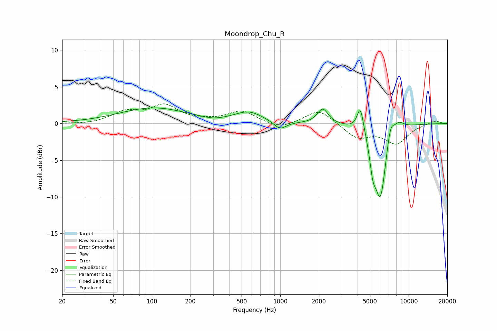

# Moondrop_Chu_R
See [usage instructions](https://github.com/jaakkopasanen/AutoEq#usage) for more options and info.

### Parametric EQs
Apply preamp of -2.2 dB when using parametric equalizer.

|   # | Type    |   Fc (Hz) |    Q |   Gain (dB) |
|-----|---------|-----------|------|-------------|
|   1 | Peaking |       103 | 0.54 |         2.1 |
|   2 | Peaking |       299 | 1.77 |        -0.3 |
|   3 | Peaking |       568 | 1.29 |         1.5 |
|   4 | Peaking |       994 | 2.91 |        -1.1 |
|   5 | Peaking |      2143 | 3.41 |         2.1 |
|   6 | Peaking |      4210 | 5.41 |         3.6 |
|   7 | Peaking |      5261 | 5.97 |        -3.1 |
|   8 | Peaking |      6025 | 2.98 |       -10.1 |
|   9 | Peaking |      7208 | 4.6  |         2.6 |
|  10 | Peaking |      8365 | 3.03 |         1.2 |

### Fixed Band EQs
When using fixed band (also called graphic) equalizer, apply preamp of **-2.8 dB** (if available) and set gains manually with these parameters.

|   # | Type    |   Fc (Hz) |    Q |   Gain (dB) |
|-----|---------|-----------|------|-------------|
|   1 | Peaking |        31 | 1.41 |        -0.1 |
|   2 | Peaking |        62 | 1.41 |         1.5 |
|   3 | Peaking |       125 | 1.41 |         2.3 |
|   4 | Peaking |       250 | 1.41 |         0.2 |
|   5 | Peaking |       500 | 1.41 |         1.7 |
|   6 | Peaking |      1000 | 1.41 |        -0.8 |
|   7 | Peaking |      2000 | 1.41 |         2   |
|   8 | Peaking |      4000 | 1.41 |        -1.9 |
|   9 | Peaking |      8000 | 1.41 |        -2.6 |
|  10 | Peaking |     16000 | 1.41 |         0.5 |

### Graphs

