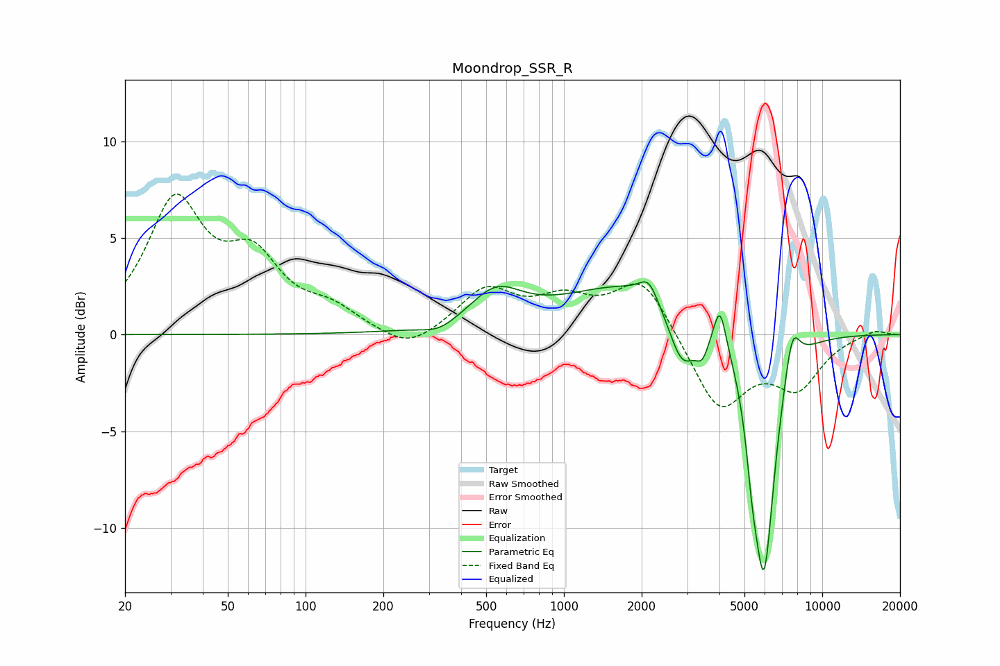

# Moondrop_SSR_R
See [usage instructions](https://github.com/jaakkopasanen/AutoEq#usage) for more options and info.

### Parametric EQs
Apply preamp of -2.8 dB when using parametric equalizer.

|   # | Type    |   Fc (Hz) |    Q |   Gain (dB) |
|-----|---------|-----------|------|-------------|
|   1 | Peaking |       329 | 2.08 |        -0.5 |
|   2 | Peaking |       545 | 1.41 |         1.8 |
|   3 | Peaking |      1998 | 0.49 |         2.8 |
|   4 | Peaking |      2128 | 4.14 |         1   |
|   5 | Peaking |      2871 | 2.53 |        -3.1 |
|   6 | Peaking |      3435 | 5.39 |        -1.2 |
|   7 | Peaking |      4017 | 6    |         2.1 |
|   8 | Peaking |      5363 | 6    |        -2.2 |
|   9 | Peaking |      5950 | 3.11 |       -12.6 |
|  10 | Peaking |      7648 | 4.47 |         2.3 |

### Fixed Band EQs
When using fixed band (also called graphic) equalizer, apply preamp of **-7.4 dB** (if available) and set gains manually with these parameters.

|   # | Type    |   Fc (Hz) |    Q |   Gain (dB) |
|-----|---------|-----------|------|-------------|
|   1 | Peaking |        31 | 1.41 |         6.6 |
|   2 | Peaking |        62 | 1.41 |         3.4 |
|   3 | Peaking |       125 | 1.41 |         1.1 |
|   4 | Peaking |       250 | 1.41 |        -1   |
|   5 | Peaking |       500 | 1.41 |         2.2 |
|   6 | Peaking |      1000 | 1.41 |         1.5 |
|   7 | Peaking |      2000 | 1.41 |         2.9 |
|   8 | Peaking |      4000 | 1.41 |        -3.9 |
|   9 | Peaking |      8000 | 1.41 |        -2.5 |
|  10 | Peaking |     16000 | 1.41 |         0.3 |

### Graphs

