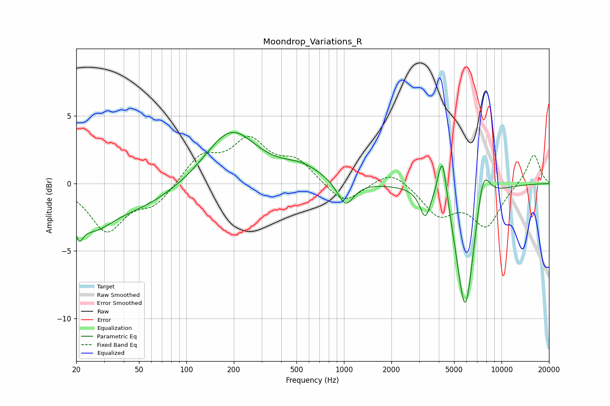

# Moondrop_Variations_R
See [usage instructions](https://github.com/jaakkopasanen/AutoEq#usage) for more options and info.

### Parametric EQs
Apply preamp of -3.9 dB when using parametric equalizer.

|   # | Type    |   Fc (Hz) |    Q |   Gain (dB) |
|-----|---------|-----------|------|-------------|
|   1 | Peaking |        21 | 5.54 |        -1.5 |
|   2 | Peaking |        25 | 1.12 |        -2.5 |
|   3 | Peaking |        50 | 0.56 |        -1.6 |
|   4 | Peaking |       192 | 0.88 |         4   |
|   5 | Peaking |       540 | 1.09 |         1   |
|   6 | Peaking |      1024 | 2.75 |        -1.9 |
|   7 | Peaking |      3277 | 4.34 |        -2   |
|   8 | Peaking |      4213 | 4.71 |         3.9 |
|   9 | Peaking |      5883 | 2.4  |        -9.8 |
|  10 | Peaking |      7634 | 3.02 |         3.1 |

### Fixed Band EQs
When using fixed band (also called graphic) equalizer, apply preamp of **-3.6 dB** (if available) and set gains manually with these parameters.

|   # | Type    |   Fc (Hz) |    Q |   Gain (dB) |
|-----|---------|-----------|------|-------------|
|   1 | Peaking |        31 | 1.41 |        -3.4 |
|   2 | Peaking |        62 | 1.41 |        -1.5 |
|   3 | Peaking |       125 | 1.41 |         2   |
|   4 | Peaking |       250 | 1.41 |         3   |
|   5 | Peaking |       500 | 1.41 |         1.6 |
|   6 | Peaking |      1000 | 1.41 |        -1.6 |
|   7 | Peaking |      2000 | 1.41 |         1.1 |
|   8 | Peaking |      4000 | 1.41 |        -2.2 |
|   9 | Peaking |      8000 | 1.41 |        -3   |
|  10 | Peaking |     16000 | 1.41 |         2.3 |

### Graphs

